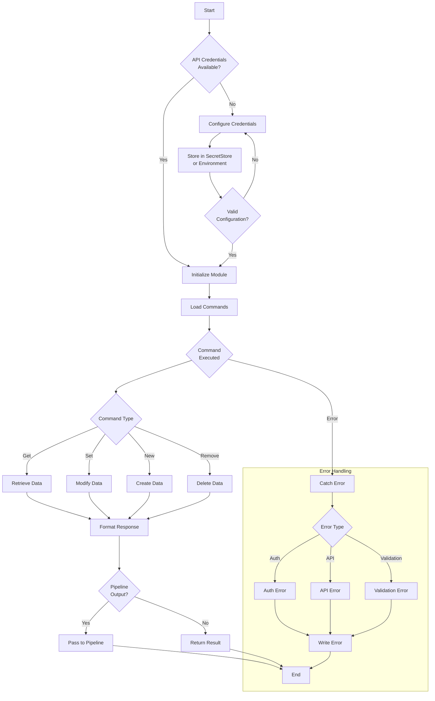
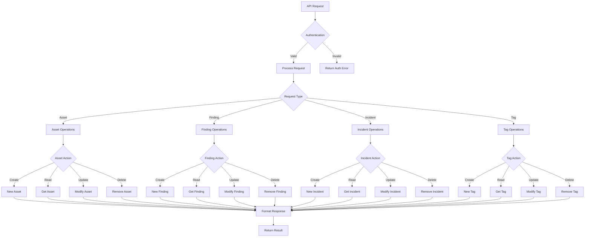
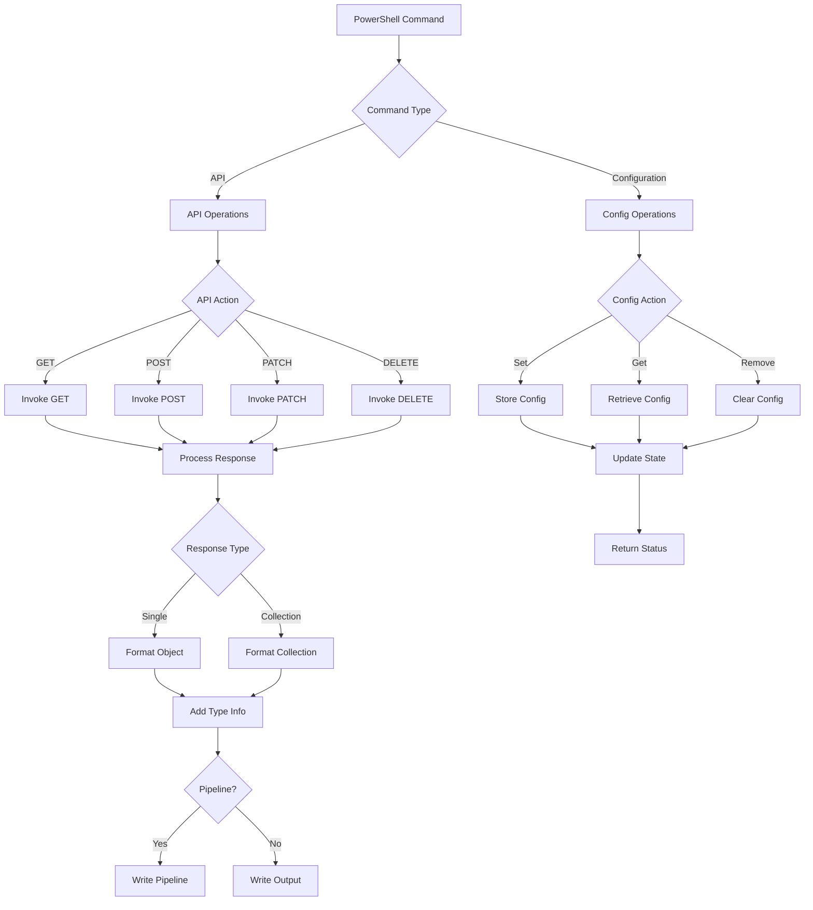
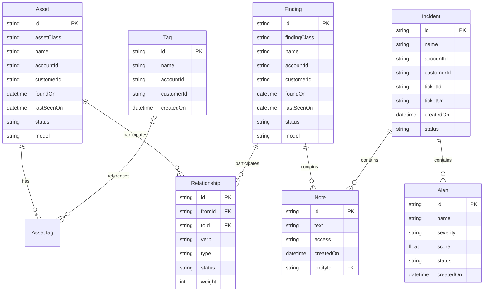
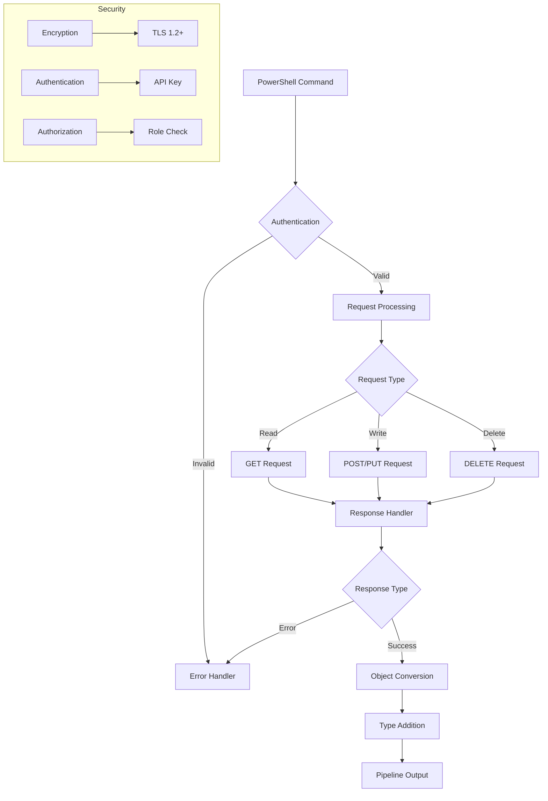
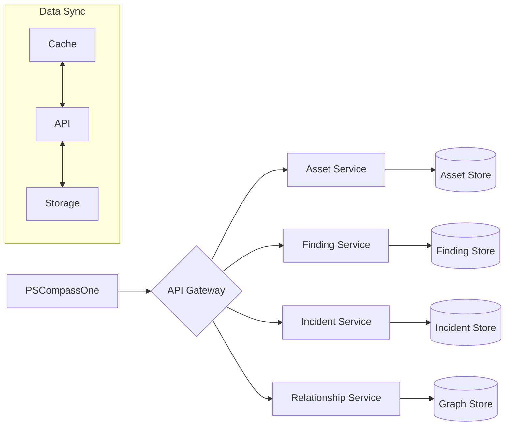
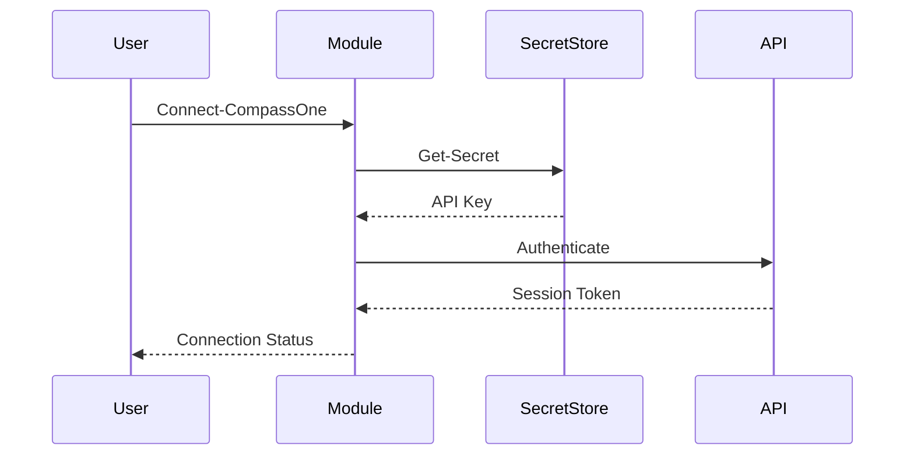
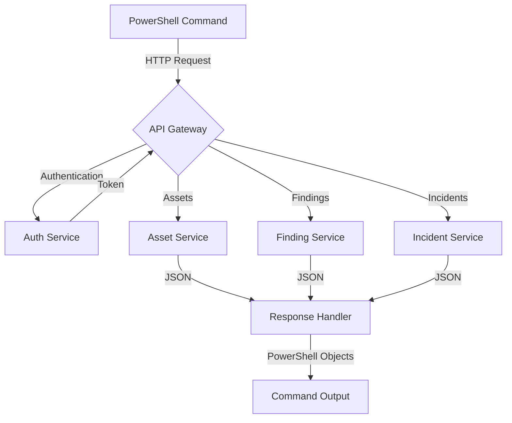
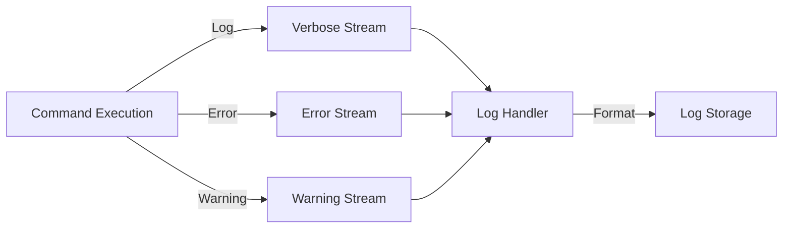

# Product Requirements Document (PRD)

## 1. INTRODUCTION

### 1.1 Purpose

This Product Requirements Document (PRD) defines the comprehensive requirements for the PSCompassOne PowerShell module, which provides programmatic access to Blackpoint's CompassOne cybersecurity platform. This document serves as the authoritative reference for:

- Development team members implementing the PowerShell module
- Quality assurance engineers testing the implementation
- Technical writers creating documentation
- Project stakeholders evaluating feature completeness
- System administrators and DevOps engineers who will use the module

### 1.2 Scope

The PSCompassOne PowerShell module will provide a native PowerShell interface to CompassOne's REST API endpoints, enabling:

- Asset inventory management and querying
- Security posture assessment and reporting
- Incident and alert monitoring
- Compliance tracking and reporting
- Tenant and configuration management
- Automated workflow integration

Key features include:

- Full PowerShell cmdlet coverage of CompassOne API endpoints
- Secure authentication and configuration management
- Pipeline support for bulk operations
- Rich object output for PowerShell integration
- Comprehensive error handling and logging
- Cross-platform compatibility (Windows, Linux, macOS)

Out of scope:

- GUI interfaces or visual tools
- Direct database access
- Custom reporting engines
- Third-party security tool integration
- Legacy PowerShell version support (<5.1)

### 1.3 Definitions and Acronyms

| Term | Definition |
|------|------------|
| API | Application Programming Interface |
| CompassOne | Blackpoint's cybersecurity platform |
| PRD | Product Requirements Document |
| PSCompassOne | The PowerShell module name |
| REST | Representational State Transfer |
| SOC | Security Operations Center |

### 1.4 References

| Document | Description |
|----------|-------------|
| CompassOne API Specification | REST API documentation and endpoints |
| PowerShell Best Practices | Microsoft's PowerShell coding guidelines |
| Security Standards | Security implementation requirements |
| Module Design Guidelines | PowerShell module architecture standards |

### 1.5 Document Conventions

This document follows these conventions:

- Code samples appear in monospace font
- Required items are marked with [Required]
- Optional items are marked with [Optional]
- API endpoints are prefixed with /v1/
- PowerShell commands use Verb-Noun format

## 2. PRODUCT DESCRIPTION

### 2.1 Product Perspective

PSCompassOne is a PowerShell module that serves as a programmatic interface to Blackpoint's CompassOne cybersecurity platform. It operates within the following context:

- Functions as a client-side PowerShell wrapper around CompassOne's REST API
- Integrates with existing PowerShell automation workflows and scripts
- Operates alongside other PowerShell security and management tools
- Requires active CompassOne platform subscription and API access
- Supports cross-platform PowerShell environments (Windows, Linux, macOS)
- Leverages standard PowerShell module infrastructure and packaging

### 2.2 Product Functions

The module provides the following core capabilities:

1. Asset Management
   - Create, read, update, and delete assets
   - Query and filter asset inventory
   - Manage asset relationships and tags
   - Track asset security posture

2. Security Operations
   - Monitor security alerts and incidents
   - Track security findings
   - Manage incident response workflows
   - Generate security reports

3. Configuration Management
   - Store and manage API credentials
   - Configure connection settings
   - Set operational preferences
   - Manage module state

4. Integration Features
   - Pipeline support for bulk operations
   - Object-based data manipulation
   - Error handling and logging
   - Progress reporting

### 2.3 User Characteristics

Primary user personas include:

1. Security Engineers
   - Advanced PowerShell expertise
   - Security tool integration experience
   - Automation workflow development
   - Incident response responsibilities

2. System Administrators
   - Intermediate PowerShell knowledge
   - Infrastructure management focus
   - Security monitoring duties
   - Compliance reporting needs

3. DevOps Engineers
   - Advanced scripting capabilities
   - CI/CD pipeline integration
   - Automated deployment focus
   - Cross-platform requirements

4. Security Analysts
   - Basic PowerShell familiarity
   - Alert investigation focus
   - Reporting requirements
   - Data analysis needs

### 2.4 Constraints

1. Technical Constraints
   - PowerShell 5.1 minimum version requirement
   - REST API rate limiting compliance
   - Cross-platform compatibility requirements
   - API version compatibility maintenance

2. Security Constraints
   - Secure credential handling requirements
   - Audit logging requirements
   - Data encryption in transit
   - Access control implementation

3. Operational Constraints
   - Performance impact limitations
   - Memory usage restrictions
   - Network bandwidth considerations
   - Response time requirements

4. Standards Compliance
   - PowerShell best practices adherence
   - Security standard compliance
   - Code style guidelines
   - Documentation requirements

### 2.5 Assumptions and Dependencies

1. Assumptions
   - Users have basic PowerShell knowledge
   - Network access to CompassOne API
   - Sufficient system resources
   - Valid API credentials available

2. Dependencies
   - CompassOne platform availability
   - REST API stability and versioning
   - PowerShell module ecosystem
   - Required PowerShell modules:
     - Microsoft.PowerShell.SecretStore
     - PSScriptAnalyzer
     - Pester
     - platyPS

3. External Factors
   - CompassOne API changes
   - PowerShell platform updates
   - Security requirement changes
   - Industry standard evolution

4. Development Dependencies
   - Source control system
   - CI/CD pipeline
   - Testing infrastructure
   - Documentation tools

## 3. PROCESS FLOWCHART







## 4. FUNCTIONAL REQUIREMENTS

### 4.1 Asset Management

#### ID: F-AST-001
#### Description
Provides comprehensive asset inventory management capabilities through PowerShell cmdlets that interact with the CompassOne API asset endpoints.
#### Priority: High

| Requirement ID | Requirement Description | Acceptance Criteria |
|----------------|------------------------|-------------------|
| F-AST-001.1 | Create new assets | - Support all asset types (Device, Container, etc.)<br>- Validate required fields<br>- Return created asset object |
| F-AST-001.2 | Retrieve assets | - Support single asset by ID<br>- Support filtered asset lists<br>- Support pagination<br>- Return typed asset objects |
| F-AST-001.3 | Update assets | - Support partial updates<br>- Validate field changes<br>- Return updated asset object |
| F-AST-001.4 | Delete assets | - Support soft delete<br>- Validate deletion permissions<br>- Return success status |
| F-AST-001.5 | Asset tagging | - Support tag assignment<br>- Support tag removal<br>- Support bulk tag operations |

### 4.2 Finding Management

#### ID: F-FND-001
#### Description
Enables management of security findings including alerts, events, and incidents through PowerShell cmdlets.
#### Priority: High

| Requirement ID | Requirement Description | Acceptance Criteria |
|----------------|------------------------|-------------------|
| F-FND-001.1 | Create findings | - Support all finding types<br>- Validate required fields<br>- Return created finding object |
| F-FND-001.2 | Retrieve findings | - Support single finding by ID<br>- Support filtered lists<br>- Support pagination<br>- Return typed finding objects |
| F-FND-001.3 | Update findings | - Support status updates<br>- Support note additions<br>- Return updated finding object |
| F-FND-001.4 | Delete findings | - Support soft delete<br>- Validate deletion permissions<br>- Return success status |
| F-FND-001.5 | Finding relationships | - Support relationship creation<br>- Support relationship queries<br>- Support relationship updates |

### 4.3 Relationship Management

#### ID: F-REL-001
#### Description
Manages relationships between assets, findings, and other entities in the CompassOne platform.
#### Priority: Medium

| Requirement ID | Requirement Description | Acceptance Criteria |
|----------------|------------------------|-------------------|
| F-REL-001.1 | Create relationships | - Support all relationship types<br>- Validate entity existence<br>- Return created relationship |
| F-REL-001.2 | Query relationships | - Support directional queries<br>- Support filtering<br>- Return related entities |
| F-REL-001.3 | Update relationships | - Support status updates<br>- Support type changes<br>- Return updated relationship |
| F-REL-001.4 | Delete relationships | - Support relationship removal<br>- Validate permissions<br>- Return success status |
| F-REL-001.5 | Bulk operations | - Support batch creation<br>- Support batch updates<br>- Support batch deletion |

### 4.4 Configuration Management

#### ID: F-CFG-001
#### Description
Handles module configuration, authentication, and connection settings.
#### Priority: High

| Requirement ID | Requirement Description | Acceptance Criteria |
|----------------|------------------------|-------------------|
| F-CFG-001.1 | Authentication setup | - Support API key storage<br>- Support multiple auth methods<br>- Validate credentials |
| F-CFG-001.2 | Connection management | - Support endpoint configuration<br>- Support timeout settings<br>- Support retry policies |
| F-CFG-001.3 | Preference storage | - Support user preferences<br>- Support default values<br>- Support persistence |
| F-CFG-001.4 | Session handling | - Support session creation<br>- Support session renewal<br>- Support session cleanup |
| F-CFG-001.5 | Error handling | - Support error logging<br>- Support error reporting<br>- Support error recovery |

### 4.5 Pipeline Support

#### ID: F-PIP-001
#### Description
Implements PowerShell pipeline functionality across all cmdlets.
#### Priority: High

| Requirement ID | Requirement Description | Acceptance Criteria |
|----------------|------------------------|-------------------|
| F-PIP-001.1 | Input processing | - Support pipeline input<br>- Support parameter binding<br>- Support type conversion |
| F-PIP-001.2 | Output formatting | - Support custom formatters<br>- Support type data<br>- Support output streams |
| F-PIP-001.3 | Bulk operations | - Support batch processing<br>- Support progress reporting<br>- Support cancellation |
| F-PIP-001.4 | Error handling | - Support error streams<br>- Support warning streams<br>- Support verbose output |
| F-PIP-001.5 | Performance | - Support efficient processing<br>- Support memory management<br>- Support large datasets |

### 4.6 Help System

#### ID: F-HLP-001
#### Description
Provides comprehensive help and documentation for all cmdlets.
#### Priority: Medium

| Requirement ID | Requirement Description | Acceptance Criteria |
|----------------|------------------------|-------------------|
| F-HLP-001.1 | Command help | - Support Get-Help integration<br>- Support detailed examples<br>- Support parameter help |
| F-HLP-001.2 | About topics | - Support conceptual help<br>- Support best practices<br>- Support troubleshooting |
| F-HLP-001.3 | Online help | - Support online documentation<br>- Support version-specific help<br>- Support updates |
| F-HLP-001.4 | Examples | - Support common scenarios<br>- Support advanced usage<br>- Support pipeline examples |
| F-HLP-001.5 | Parameter sets | - Support parameter validation<br>- Support parameter sets<br>- Support dynamic parameters |

### 4.7 Logging and Diagnostics

#### ID: F-LOG-001
#### Description
Implements comprehensive logging and diagnostic capabilities.
#### Priority: Medium

| Requirement ID | Requirement Description | Acceptance Criteria |
|----------------|------------------------|-------------------|
| F-LOG-001.1 | Operation logging | - Support verbose logging<br>- Support debug logging<br>- Support error logging |
| F-LOG-001.2 | Performance metrics | - Support timing data<br>- Support resource usage<br>- Support bottleneck detection |
| F-LOG-001.3 | Diagnostic tools | - Support connection testing<br>- Support credential validation<br>- Support API diagnostics |
| F-LOG-001.4 | Log management | - Support log rotation<br>- Support log cleanup<br>- Support log export |
| F-LOG-001.5 | Troubleshooting | - Support error analysis<br>- Support health checks<br>- Support remediation |

### 4.8 Security Features

#### ID: F-SEC-001
#### Description
Implements security features and best practices.
#### Priority: High

| Requirement ID | Requirement Description | Acceptance Criteria |
|----------------|------------------------|-------------------|
| F-SEC-001.1 | Credential handling | - Support secure storage<br>- Support encryption<br>- Support token management |
| F-SEC-001.2 | Access control | - Support permission validation<br>- Support role checking<br>- Support scope enforcement |
| F-SEC-001.3 | Secure communication | - Support HTTPS only<br>- Support TLS validation<br>- Support certificate handling |
| F-SEC-001.4 | Audit logging | - Support action tracking<br>- Support user tracking<br>- Support change logging |
| F-SEC-001.5 | Data protection | - Support sensitive data handling<br>- Support data masking<br>- Support secure deletion |

### 5. NON-FUNCTIONAL REQUIREMENTS

#### 5.1 Performance Requirements

| Requirement | Description | Target Metric |
|-------------|-------------|---------------|
| Response Time | Maximum time for cmdlet execution | < 2 seconds for simple operations<br>< 5 seconds for complex operations |
| Throughput | Number of concurrent operations | Minimum 10 concurrent operations |
| Memory Usage | Maximum memory footprint | < 100MB base memory<br>< 500MB during bulk operations |
| CPU Usage | Maximum CPU utilization | < 30% for single operations<br>< 70% for bulk operations |
| Network Bandwidth | Maximum bandwidth consumption | < 1MB/s per connection |
| Startup Time | Time to load module | < 1 second |

#### 5.2 Safety Requirements

| Requirement | Description | Implementation |
|-------------|-------------|----------------|
| Data Backup | Protection against data loss | - Automatic backup of configuration<br>- Transaction logging<br>- Rollback capabilities |
| Error Recovery | Handling of system failures | - Automatic retry for transient failures<br>- Session recovery mechanisms<br>- State preservation |
| Operation Validation | Prevent dangerous operations | - Parameter validation<br>- Confirmation prompts<br>- Dry-run capabilities |
| Resource Protection | Prevent resource exhaustion | - Connection pooling<br>- Resource cleanup<br>- Memory management |
| State Management | Maintain system consistency | - Transaction boundaries<br>- State validation<br>- Cleanup on failure |

#### 5.3 Security Requirements

| Requirement | Description | Implementation |
|-------------|-------------|----------------|
| Authentication | Secure API access | - API key management<br>- SecretStore integration<br>- Token rotation |
| Authorization | Access control | - Role-based access<br>- Scope validation<br>- Permission checking |
| Data Protection | Secure data handling | - TLS 1.2+ encryption<br>- Secure credential storage<br>- Data masking |
| Audit Logging | Security event tracking | - Operation logging<br>- Access logging<br>- Change tracking |
| Compliance | Security standards | - FIPS compliance<br>- CIS benchmarks<br>- NIST guidelines |

#### 5.4 Quality Requirements

##### 5.4.1 Availability
- Uptime: 99.9% module availability
- Recovery Time Objective (RTO): < 5 minutes
- Recovery Point Objective (RPO): < 1 minute
- Fault tolerance for network interruptions

##### 5.4.2 Maintainability
- Code coverage: > 90%
- Documentation coverage: 100%
- Technical debt ratio: < 5%
- Module update time: < 15 minutes

##### 5.4.3 Usability
- Command discovery: < 5 minutes
- Learning curve: < 1 day for basic operations
- Error message clarity: 100% actionable messages
- Help system completeness: 100% command coverage

##### 5.4.4 Scalability
- Linear performance up to 1000 assets
- Support for 100+ concurrent users
- Efficient handling of large datasets
- Resource usage scaling with load

##### 5.4.5 Reliability
- Mean Time Between Failures (MTBF): > 720 hours
- Mean Time To Recovery (MTTR): < 5 minutes
- Error rate: < 0.1% of operations
- Data consistency: 100%

#### 5.5 Compliance Requirements

| Requirement | Standard | Implementation |
|-------------|----------|----------------|
| Code Standards | PowerShell Best Practices | - PSScriptAnalyzer rules<br>- Style guidelines<br>- Naming conventions |
| Documentation | PowerShell Help Standards | - Comment-based help<br>- XML documentation<br>- Example coverage |
| Security | Security Best Practices | - HTTPS only<br>- Secure defaults<br>- Credential handling |
| Testing | Testing Standards | - Unit test coverage<br>- Integration testing<br>- Performance testing |
| Versioning | Semantic Versioning | - Version tracking<br>- Compatibility checking<br>- Update management |

#### 5.6 Environmental Requirements

| Requirement | Description | Target |
|-------------|-------------|--------|
| PowerShell Version | Minimum supported version | PowerShell 5.1+ |
| Operating System | Supported platforms | Windows, Linux, macOS |
| Memory | Minimum system memory | 4GB RAM |
| Storage | Minimum free space | 100MB |
| Network | Minimum bandwidth | 1 Mbps |

#### 5.7 Support Requirements

| Requirement | Description | Target |
|-------------|-------------|--------|
| Documentation | Comprehensive documentation | - Online help<br>- Examples<br>- Troubleshooting guides |
| Updates | Regular maintenance | - Monthly updates<br>- Security patches<br>- Bug fixes |
| Compatibility | Version compatibility | - Backward compatibility<br>- API version support<br>- Breaking change notices |
| Technical Support | Support channels | - GitHub issues<br>- Documentation<br>- Community forums |

## 6. DATA REQUIREMENTS

### 6.1 Data Models

The PSCompassOne module interacts with the following core data entities:



### 6.2 Data Storage

#### 6.2.1 Local Storage
- Configuration data stored in PowerShell SecretStore or environment variables
- Credential caching with secure string encryption
- Session state maintained in memory during module operation
- Temporary data cached in user profile directory

#### 6.2.2 Data Retention
- API credentials stored until explicitly removed
- Session data cleared on module unload
- Cache data expires after 24 hours
- Audit logs retained for 90 days

#### 6.2.3 Backup and Recovery
- Configuration backup to encrypted files
- Automatic credential recovery from SecretStore
- Session state recovery after connection interruption
- Cache rebuild on corruption detection

### 6.3 Data Processing

#### 6.3.1 Data Flow



#### 6.3.2 Data Security

| Layer | Security Measure |
|-------|-----------------|
| Transport | TLS 1.2+ encryption |
| Authentication | API key with secure storage |
| Authorization | Role-based access control |
| Storage | SecretStore encryption |
| Memory | Secure string handling |
| Cache | Encrypted temporary storage |

#### 6.3.3 Data Validation

| Data Type | Validation Rules |
|-----------|-----------------|
| Asset IDs | UUID format |
| Dates | ISO 8601 format |
| Enums | Predefined values only |
| Strings | Max length, allowed chars |
| Numbers | Range validation |
| Objects | Schema validation |

### 6.4 Data Integration



### 6.5 Data Migration

| Phase | Requirements |
|-------|-------------|
| Export | JSON/CSV format support |
| Transform | Data mapping capabilities |
| Import | Bulk operation support |
| Validate | Data integrity checks |
| Rollback | Transaction support |

### 6.6 Data Compliance

| Requirement | Implementation |
|-------------|----------------|
| Data Privacy | PII handling controls |
| Audit Trail | Operation logging |
| Encryption | TLS and at-rest encryption |
| Access Control | Role-based permissions |
| Data Lifecycle | Retention policies |

## 7. EXTERNAL INTERFACES

### 7.1 User Interfaces

The PSCompassOne module operates through the PowerShell command-line interface and follows standard PowerShell conventions:

#### 7.1.1 Command Line Interface
- Consistent verb-noun command naming (Get-Asset, New-Finding, etc.)
- Standard PowerShell parameter binding and pipeline support
- Tab completion for commands and parameters
- Color-coded output for different message types:
  - Errors in red
  - Warnings in yellow
  - Verbose output in gray
  - Success messages in green

#### 7.1.2 Output Formatting
```powershell
# Example default table output
Format-Table -InputObject $assets -Property Id, Name, Status, LastSeenOn

# Example list output
Format-List -InputObject $asset -Property *

# Example grid view integration
Get-Asset | Out-GridView
```

### 7.2 Software Interfaces

#### 7.2.1 CompassOne REST API
- Protocol: HTTPS
- Authentication: API Key
- Base URL: https://api.compassone.blackpoint.io/v1
- Content Type: application/json
- Rate Limiting: Compliant with API throttling requirements

| Interface | Purpose | Data Format |
|-----------|---------|-------------|
| Assets API | Asset management | JSON |
| Findings API | Security findings | JSON |
| Incidents API | Incident tracking | JSON |
| Tags API | Resource tagging | JSON |
| Notes API | Documentation | JSON |

#### 7.2.2 PowerShell Integration
- PowerShell Version: 5.1+ (Windows PowerShell), 7.0+ (PowerShell Core)
- Required Modules:
  - Microsoft.PowerShell.SecretStore
  - PSScriptAnalyzer
  - Pester
  - platyPS

#### 7.2.3 Authentication Services


### 7.3 Communication Interfaces

#### 7.3.1 Network Requirements
- Protocol: HTTPS (TLS 1.2+)
- Port: 443
- Bandwidth: Minimum 1 Mbps
- Timeout: 30 seconds default
- Retry Policy: 3 attempts with exponential backoff

#### 7.3.2 Data Exchange Formats

| Format | Usage | Example |
|--------|--------|---------|
| JSON Request | API Calls | `{"asset": {"name": "test", "type": "device"}}` |
| JSON Response | API Results | `{"id": "123", "status": "active"}` |
| PowerShell Objects | Internal Processing | `[PSCustomObject]@{Id="123"}` |
| Error Objects | Error Handling | `ErrorRecord` with category and details |

#### 7.3.3 API Communication Flow



#### 7.3.4 Error Communication
- HTTP Status Codes: Standard REST API status codes
- Error Response Format:
```json
{
    "error": {
        "code": "ERR_CODE",
        "message": "Human readable message",
        "details": {
            "field": "Additional context"
        }
    }
}
```

### 7.4 Security Interfaces

#### 7.4.1 Authentication Interface
- API Key Storage:
  - SecretStore (primary)
  - Environment Variables (secondary)
  - Command Line (temporary)
- Session Management:
  - Token-based authentication
  - Automatic token refresh
  - Secure token storage

#### 7.4.2 Encryption Interface
- TLS 1.2+ for all API communication
- AES-256 for local credential encryption
- SecretStore encryption for persistent storage

#### 7.4.3 Audit Interface


## 8. APPENDICES

### 8.1 GLOSSARY

| Term | Definition |
|------|------------|
| Asset | Any entity tracked in CompassOne (devices, users, software, etc.) |
| Cmdlet | PowerShell command that follows Verb-Noun naming convention |
| Finding | Security-related discovery (alert, event, incident) in CompassOne |
| Pipeline | PowerShell's mechanism for passing objects between commands |
| Relationship | Connection between two entities in CompassOne |
| Tag | Label that can be applied to assets for organization/filtering |
| Tenant | Isolated customer environment within CompassOne |
| Verb-Noun | PowerShell command naming format (e.g., Get-Asset) |

### 8.2 ACRONYMS

| Acronym | Definition |
|---------|------------|
| API | Application Programming Interface |
| BYOD | Bring Your Own Device |
| COTS | Commercial Off-The-Shelf |
| CRUD | Create, Read, Update, Delete |
| FIPS | Federal Information Processing Standards |
| FOSS | Free and Open Source Software |
| FQDN | Fully Qualified Domain Name |
| HIPAA | Health Insurance Portability and Accountability Act |
| IP | Internet Protocol |
| MAC | Media Access Control |
| MFA | Multi-Factor Authentication |
| OS | Operating System |
| PII | Personally Identifiable Information |
| REST | Representational State Transfer |
| SOC | Security Operations Center |
| TLS | Transport Layer Security |
| UUID | Universally Unique Identifier |

### 8.3 ADDITIONAL REFERENCES

| Reference | Description | URL |
|-----------|-------------|-----|
| PowerShell Gallery | Official package repository | https://www.powershellgallery.com |
| PowerShell Docs | Microsoft's PowerShell documentation | https://docs.microsoft.com/powershell |
| SecretStore Module | Secure credential storage documentation | https://docs.microsoft.com/powershell/module/microsoft.powershell.secretstore |
| Pester | PowerShell testing framework | https://pester.dev |
| PSScriptAnalyzer | PowerShell linting tool | https://github.com/PowerShell/PSScriptAnalyzer |
| platyPS | PowerShell help documentation tool | https://github.com/PowerShell/platyPS |

### 8.4 DEVELOPMENT TOOLS

| Tool | Purpose | Version |
|------|---------|---------|
| Visual Studio Code | Primary development environment | Latest |
| PowerShell Extension | VS Code PowerShell support | Latest |
| Git | Version control | 2.0+ |
| Pester | Testing framework | 5.0+ |
| PSScriptAnalyzer | Code analysis | Latest |
| platyPS | Documentation generation | Latest |
| SecretStore | Secure storage | Latest |

### 8.5 API SPECIFICATIONS

| Endpoint Category | Base Path | Authentication |
|------------------|-----------|----------------|
| Assets | /v1/assets | API Key |
| Findings | /v1/findings | API Key |
| Incidents | /v1/incidents | API Key |
| Relationships | /v1/relationships | API Key |
| Tags | /v1/tags | API Key |
| Notes | /v1/notes | API Key |

### 8.6 SECURITY CONSIDERATIONS

| Category | Requirement | Implementation |
|----------|-------------|----------------|
| Authentication | API Key Storage | SecretStore or Environment Variables |
| Transport | Secure Communication | TLS 1.2+ |
| Credentials | Secure Handling | SecureString Usage |
| Audit | Operation Logging | PowerShell Event Logging |
| Compliance | Security Standards | FIPS Compliance |

### 8.7 PLATFORM COMPATIBILITY

| Platform | Version | Notes |
|----------|---------|-------|
| Windows PowerShell | 5.1+ | Full Compatibility |
| PowerShell Core | 7.0+ | Recommended |
| Windows | 10/11/Server | Full Support |
| Linux | Major Distributions | Core Features |
| macOS | 10.15+ | Core Features |