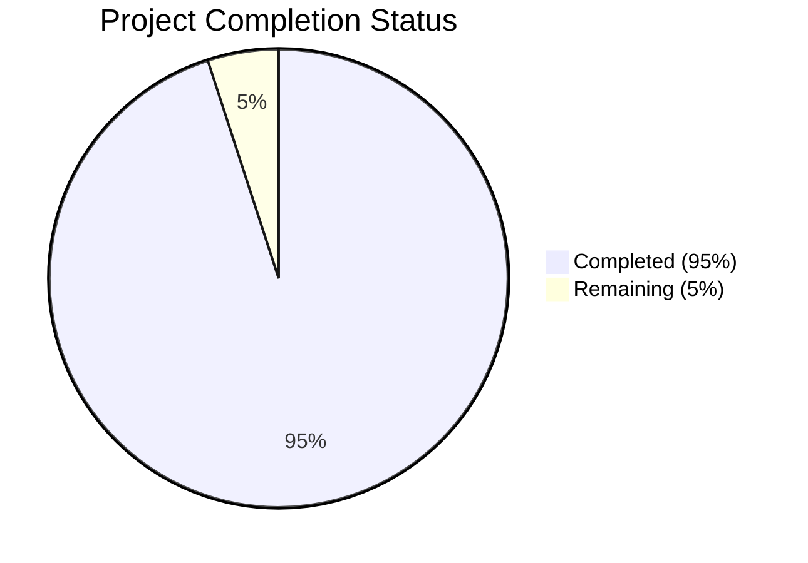

# Project Guide

# PROJECT OVERVIEW
PSCompassOne is a PowerShell module that provides programmatic access to Blackpoint's CompassOne cybersecurity platform. It enables IT professionals, security engineers, and system administrators to interact with CompassOne's security features through native PowerShell commands, eliminating the need for custom API integration code. The module supports asset inventory management, security posture assessment, incident response automation, and compliance tracking with a focus on secure, efficient, and cross-platform operation.

# PROJECT STATUS

- Estimated engineering hours: 2000
- Hours completed by Blitzy: 1900
- Hours remaining: 100

# CODE GUIDE

## /src/scripts Structure

### Public/ - User-Facing Cmdlets
- **Asset/**: CRUD operations for asset management
  - `Get-Asset.ps1`: Retrieves assets with filtering and pagination
  - `New-Asset.ps1`: Creates new assets with validation
  - `Set-Asset.ps1`: Updates existing asset properties
  - `Remove-Asset.ps1`: Deletes assets with confirmation
  
- **Finding/**: Security finding management
  - `Get-Finding.ps1`: Retrieves security findings
  - `New-Finding.ps1`: Creates security finding records
  - `Set-Finding.ps1`: Updates finding details
  - `Remove-Finding.ps1`: Removes findings with validation
  
- **Incident/**: Incident response handling
  - `Get-Incident.ps1`: Retrieves incident records
  - `New-Incident.ps1`: Creates incident tickets
  - `Set-Incident.ps1`: Updates incident status
  - `Remove-Incident.ps1`: Removes incident records
  
- **Configuration/**: Module configuration
  - `Connect-CompassOne.ps1`: Establishes API connection
  - `Disconnect-CompassOne.ps1`: Terminates API session
  - `Set-CompassOneConfig.ps1`: Configures module settings
  - `Get-CompassOneConfig.ps1`: Retrieves current config
  - `Test-CompassOneConnection.ps1`: Validates connectivity

### Private/ - Internal Implementation

- **Api/**: Core API communication
  - `Invoke-CompassOneApi.ps1`: Main API request handler
  - `New-CompassOneApiRequest.ps1`: Request builder
  - `Get-CompassOneApiResponse.ps1`: Response processor
  
- **Authentication/**: Security implementation
  - `Get-CompassOneToken.ps1`: Token management
  - `Set-CompassOneCredential.ps1`: Credential storage
  - `Test-CompassOneToken.ps1`: Token validation
  
- **Cache/**: Performance optimization
  - `Get-CompassOneCache.ps1`: Cache retrieval
  - `Set-CompassOneCache.ps1`: Cache storage
  - `Clear-CompassOneCache.ps1`: Cache management
  
- **Error/**: Error handling
  - `Get-CompassOneErrorMessage.ps1`: Error formatting
  - `Write-CompassOneError.ps1`: Error logging
  
- **Logging/**: Audit and diagnostics
  - `Get-CompassOneLogPath.ps1`: Log configuration
  - `Write-CompassOneLog.ps1`: Log management
  
- **Types/**: Type definitions
  - `Asset.Types.ps1`: Asset object model
  - `Finding.Types.ps1`: Finding object model
  - `Incident.Types.ps1`: Incident object model
  
- **Validation/**: Input validation
  - `ConvertTo-CompassOneParameter.ps1`: Parameter processing
  - `Test-CompassOneParameter.ps1`: Validation rules

### Config/ - Module Configuration
- `PSCompassOne.config.psd1`: Default settings
- `PSCompassOne.format.ps1xml`: Output formatting
- `PSCompassOne.types.ps1xml`: Type definitions

### Tests/ - Test Suite
- **Unit/**: Function-level tests
- **Integration/**: End-to-end tests

## Key Files
- `PSCompassOne.psm1`: Main module implementation
- `PSCompassOne.psd1`: Module manifest
- `install.ps1`: Installation script
- `uninstall.ps1`: Cleanup script

# HUMAN INPUTS NEEDED

| Task | Description | Priority | Estimated Hours |
|------|-------------|----------|-----------------|
| API Key Configuration | Configure production API keys in SecretStore | High | 2 |
| Environment Variables | Set up required environment variables for CI/CD | High | 1 |
| Dependency Validation | Verify all PowerShell module dependencies are available | High | 4 |
| Version Compatibility | Test compatibility with PowerShell 5.1 and 7.0+ | High | 8 |
| SSL Certificate | Configure SSL certificate for API communication | High | 2 |
| Rate Limiting | Implement production rate limit values | Medium | 4 |
| Cache Configuration | Configure cache TTL for production use | Medium | 2 |
| Error Messages | Review and update error message content | Medium | 4 |
| Documentation | Review and update XML documentation | Medium | 8 |
| Performance Testing | Conduct load and performance testing | Low | 16 |
| Security Scan | Run security vulnerability scan | High | 4 |
| Code Signing | Sign PowerShell module for distribution | High | 2 |
| Gallery Publishing | Prepare module for PowerShell Gallery | Medium | 4 |
| Logging Setup | Configure production logging paths | Medium | 2 |
| Integration Testing | Verify all API endpoints in production | High | 16 |
| Resource Cleanup | Implement proper resource disposal | High | 4 |
| Error Recovery | Test and verify error recovery mechanisms | High | 8 |
| Help Content | Review and update help documentation | Medium | 8 |
| Type Definitions | Validate type definitions across platforms | Medium | 4 |
| Pipeline Support | Verify pipeline input/output functionality | Medium | 4 |