# Technical Specifications

# 1. INTRODUCTION

## 1.1 EXECUTIVE SUMMARY

PSCompassOne is a PowerShell module that provides programmatic access to Blackpoint's CompassOne cybersecurity platform through native PowerShell commands. The module addresses the critical need for automation and integration capabilities within security operations by enabling PowerShell users to interact with CompassOne's comprehensive security features without writing custom API integration code.

The module serves IT professionals, security engineers, system administrators, and DevOps teams who rely on PowerShell for automation and security management. By providing a native PowerShell interface, PSCompassOne reduces implementation time, improves operational efficiency, and enables seamless integration with existing PowerShell-based workflows.

## 1.2 SYSTEM OVERVIEW

### Project Context

| Aspect | Description |
|--------|-------------|
| Business Context | Enables programmatic access to CompassOne's security platform through PowerShell |
| Market Position | First official PowerShell integration for CompassOne platform |
| Current Limitations | Manual API integration required for PowerShell automation |
| Enterprise Integration | Complements existing security tools and PowerShell automation frameworks |

### High-Level Description

| Component | Description |
|-----------|-------------|
| Core Capabilities | - Asset inventory management<br>- Security posture assessment<br>- Incident response automation<br>- Compliance tracking<br>- Tenant management |
| Architecture | - PowerShell module structure<br>- REST API integration<br>- Secure credential management<br>- Cross-platform compatibility |
| Major Components | - Public cmdlets for API operations<br>- Authentication and configuration management<br>- Pipeline support for bulk operations<br>- Error handling and logging system |
| Technical Approach | - Modern PowerShell practices<br>- Secure by default<br>- Comprehensive documentation<br>- Test-driven development |

### Success Criteria

| Category | Metrics |
|----------|---------|
| Performance | - Command execution < 2s<br>- Memory usage < 100MB<br>- Concurrent operations > 10 |
| Quality | - Code coverage > 90%<br>- Zero security vulnerabilities<br>- Documentation coverage 100% |
| Adoption | - PowerShell Gallery downloads<br>- Active users<br>- Community contributions |
| Business Impact | - Reduced integration time<br>- Improved automation efficiency<br>- Enhanced security operations |

## 1.3 SCOPE

### In-Scope

#### Core Features

| Feature Category | Included Capabilities |
|-----------------|----------------------|
| Asset Management | - CRUD operations for all asset types<br>- Asset relationship management<br>- Tag management<br>- Asset inventory queries |
| Security Operations | - Alert monitoring<br>- Incident management<br>- Finding tracking<br>- Security posture assessment |
| Authentication | - API key management<br>- Secure credential storage<br>- Session handling |
| Integration | - Pipeline support<br>- Object output<br>- Error handling<br>- Logging |

#### Implementation Boundaries

| Boundary Type | Coverage |
|--------------|----------|
| System | CompassOne REST API endpoints |
| Users | PowerShell-proficient IT professionals |
| Platforms | Windows PowerShell 5.1+, PowerShell 7.0+ |
| Data Domains | Assets, Findings, Incidents, Relationships |

### Out-of-Scope

| Category | Excluded Elements |
|----------|------------------|
| Features | - GUI interfaces<br>- Custom reporting engines<br>- Direct database access<br>- Third-party security tool integration |
| Platforms | - Legacy PowerShell versions (<5.1)<br>- Non-PowerShell environments |
| Integration | - Custom API endpoints<br>- Non-REST protocols<br>- External authentication systems |
| Support | - Custom development services<br>- Security consulting<br>- Platform configuration |

# 2. SYSTEM ARCHITECTURE

## 2.1 High-Level Architecture

The PSCompassOne module follows a layered architecture pattern with clear separation of concerns between the PowerShell interface, core business logic, and API communication layers.

### System Context Diagram (Level 0)

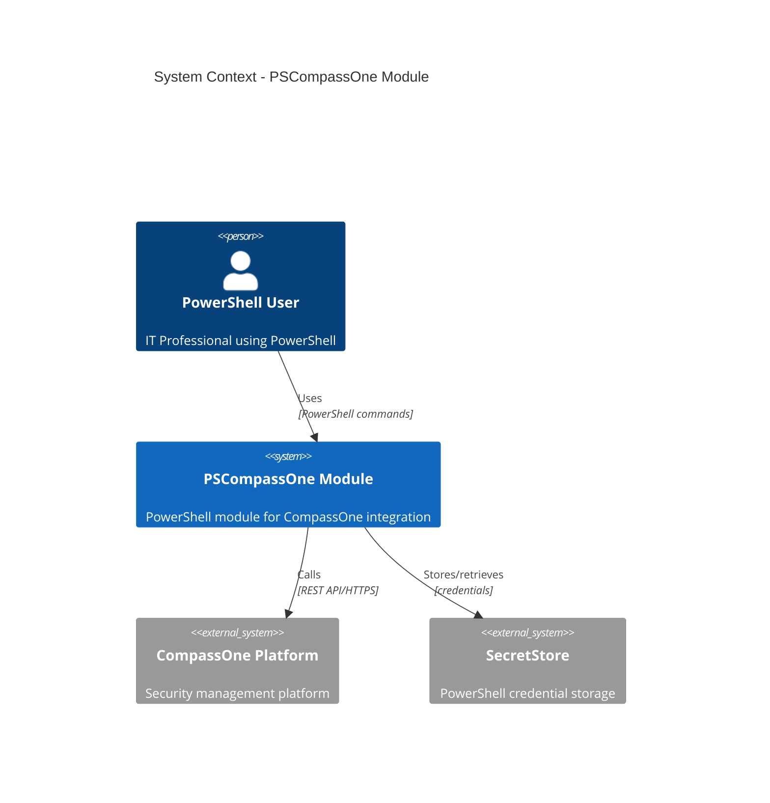
```mermaid
C4Context
    title System Context - PSCompassOne Module

    Person(user, "PowerShell User", "IT Professional using PowerShell")
    System(pscompassone, "PSCompassOne Module", "PowerShell module for CompassOne integration")
    System_Ext(compassone, "CompassOne Platform", "Security management platform")
    System_Ext(secretstore, "SecretStore", "PowerShell credential storage")
    
    Rel(user, pscompassone, "Uses", "PowerShell commands")
    Rel(pscompassone, compassone, "Calls", "REST API/HTTPS")
    Rel(pscompassone, secretstore, "Stores/retrieves", "credentials")
    
    UpdateLayoutConfig($c4ShapeInRow="3", $c4BoundaryInRow="1")
```

### Container Diagram (Level 1)

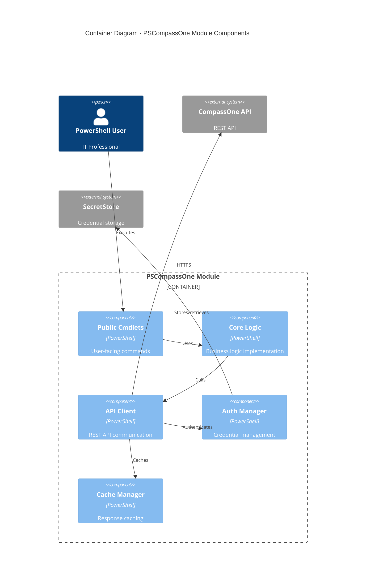
```mermaid
C4Container
    title Container Diagram - PSCompassOne Module Components

    Person(user, "PowerShell User", "IT Professional")
    
    Container_Boundary(module, "PSCompassOne Module") {
        Component(cmdlets, "Public Cmdlets", "PowerShell", "User-facing commands")
        Component(core, "Core Logic", "PowerShell", "Business logic implementation")
        Component(api, "API Client", "PowerShell", "REST API communication")
        Component(auth, "Auth Manager", "PowerShell", "Credential management")
        Component(cache, "Cache Manager", "PowerShell", "Response caching")
    }
    
    System_Ext(compassone, "CompassOne API", "REST API")
    System_Ext(secretstore, "SecretStore", "Credential storage")
    
    Rel(user, cmdlets, "Executes")
    Rel(cmdlets, core, "Uses")
    Rel(core, api, "Calls")
    Rel(api, auth, "Authenticates")
    Rel(api, cache, "Caches")
    Rel(auth, secretstore, "Stores/retrieves")
    Rel(api, compassone, "HTTPS")
```

## 2.2 Component Details

### Component Diagram (Level 2)

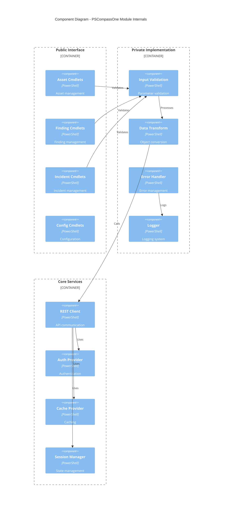
```mermaid
C4Component
    title Component Diagram - PSCompassOne Module Internals

    Container_Boundary(public, "Public Interface") {
        Component(asset, "Asset Cmdlets", "PowerShell", "Asset management")
        Component(finding, "Finding Cmdlets", "PowerShell", "Finding management")
        Component(incident, "Incident Cmdlets", "PowerShell", "Incident management")
        Component(config, "Config Cmdlets", "PowerShell", "Configuration")
    }
    
    Container_Boundary(private, "Private Implementation") {
        Component(validation, "Input Validation", "PowerShell", "Parameter validation")
        Component(transform, "Data Transform", "PowerShell", "Object conversion")
        Component(error, "Error Handler", "PowerShell", "Error management")
        Component(logger, "Logger", "PowerShell", "Logging system")
    }
    
    Container_Boundary(core, "Core Services") {
        Component(rest, "REST Client", "PowerShell", "API communication")
        Component(auth, "Auth Provider", "PowerShell", "Authentication")
        Component(cache, "Cache Provider", "PowerShell", "Caching")
        Component(session, "Session Manager", "PowerShell", "State management")
    }
    
    Rel(asset, validation, "Validates")
    Rel(finding, validation, "Validates")
    Rel(incident, validation, "Validates")
    Rel(validation, transform, "Processes")
    Rel(transform, rest, "Calls")
    Rel(rest, auth, "Uses")
    Rel(rest, cache, "Uses")
    Rel(rest, session, "Uses")
    Rel_R(error, logger, "Logs")
```

### Data Flow Diagram

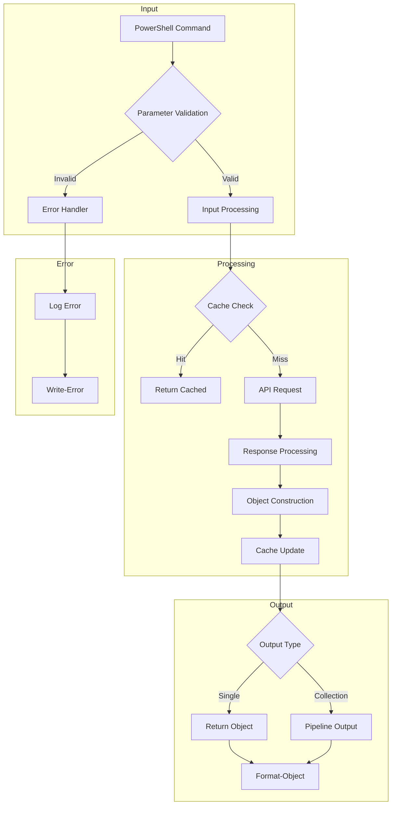
```mermaid
flowchart TD
    subgraph Input
        A[PowerShell Command] --> B{Parameter Validation}
        B -->|Valid| C[Input Processing]
        B -->|Invalid| D[Error Handler]
    end
    
    subgraph Processing
        C --> E{Cache Check}
        E -->|Hit| F[Return Cached]
        E -->|Miss| G[API Request]
        G --> H[Response Processing]
        H --> I[Object Construction]
        I --> J[Cache Update]
    end
    
    subgraph Output
        J --> K{Output Type}
        K -->|Single| L[Return Object]
        K -->|Collection| M[Pipeline Output]
        L --> N[Format-Object]
        M --> N
    end
    
    subgraph Error
        D --> O[Log Error]
        O --> P[Write-Error]
    end
```

## 2.3 Technical Decisions

### Architecture Style
- Layered architecture for clear separation of concerns
- Command pattern for PowerShell cmdlet implementation
- Repository pattern for API interaction
- Factory pattern for object creation
- Observer pattern for event handling

### Communication Patterns
| Pattern | Usage | Justification |
|---------|--------|--------------|
| Synchronous | API Calls | Direct response requirement |
| Pipeline | Data Processing | PowerShell standard |
| Event-based | Logging | Decoupled logging |
| Cached | Repeated Queries | Performance optimization |

### Data Storage Strategy
| Storage Type | Usage | Implementation |
|-------------|--------|----------------|
| Configuration | SecretStore | Secure credential storage |
| Cache | Memory | Fast access to recent data |
| Session | Memory | Temporary state management |
| Audit | File System | Persistent logging |

## 2.4 Cross-Cutting Concerns

### Deployment Diagram

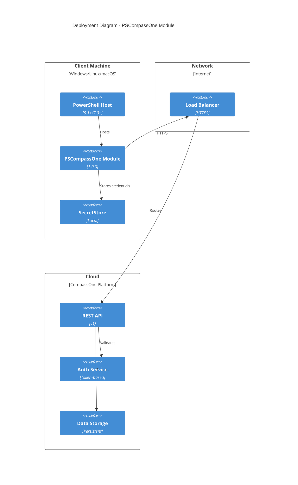
```mermaid
C4Deployment
    title Deployment Diagram - PSCompassOne Module

    Deployment_Node(client, "Client Machine", "Windows/Linux/macOS") {
        Container(powershell, "PowerShell Host", "5.1+/7.0+")
        Container(module, "PSCompassOne Module", "1.0.0")
        Container(secretstore, "SecretStore", "Local")
    }
    
    Deployment_Node(network, "Network", "Internet") {
        Container(lb, "Load Balancer", "HTTPS")
    }
    
    Deployment_Node(cloud, "Cloud", "CompassOne Platform") {
        Container(api, "REST API", "v1")
        Container(auth, "Auth Service", "Token-based")
        Container(storage, "Data Storage", "Persistent")
    }
    
    Rel(powershell, module, "Hosts")
    Rel(module, secretstore, "Stores credentials")
    Rel(module, lb, "HTTPS")
    Rel(lb, api, "Routes")
    Rel(api, auth, "Validates")
    Rel(api, storage, "Persists")
```

### Monitoring and Observability

| Aspect | Implementation | Details |
|--------|----------------|---------|
| Metrics | Write-Verbose | Operation timing and counts |
| Tracing | CorrelationId | Request tracking |
| Health | Test-Connection | Endpoint availability |
| Status | Get-Status | System state |

### Error Handling Strategy

| Error Type | Handling | Recovery |
|------------|----------|----------|
| Network | Retry with backoff | Automatic |
| Authentication | Token refresh | Automatic |
| Validation | Error message | Manual |
| System | Exception | Manual |

### Security Architecture

| Layer | Mechanism | Implementation |
|-------|-----------|----------------|
| Transport | TLS 1.2+ | HTTPS |
| Authentication | API Key | SecretStore |
| Authorization | Role-based | API-enforced |
| Audit | Event Log | File-based |

### Performance Requirements

| Metric | Target | Implementation |
|--------|--------|----------------|
| Response Time | < 2s | Caching |
| Throughput | 10 req/s | Connection pooling |
| Memory | < 100MB | Resource cleanup |
| CPU | < 30% | Efficient algorithms |

# 3. SYSTEM COMPONENTS ARCHITECTURE

## 3.1 Command Line Interface Design

### 3.1.1 Command Structure

| Component | Description | Implementation |
|-----------|-------------|----------------|
| Command Naming | Verb-Noun format | `Get-Asset`, `New-Finding`, `Remove-Incident` |
| Parameter Design | Named and positional | Required parameters first, optional with defaults |
| Pipeline Support | Input/Output objects | ValueFromPipeline, ValueFromPipelineByPropertyName |
| Output Types | Strongly typed objects | PSCustomObject with type information |
| Error Handling | Structured error records | ErrorCategory and custom error types |

### 3.1.2 Input/Output Specifications

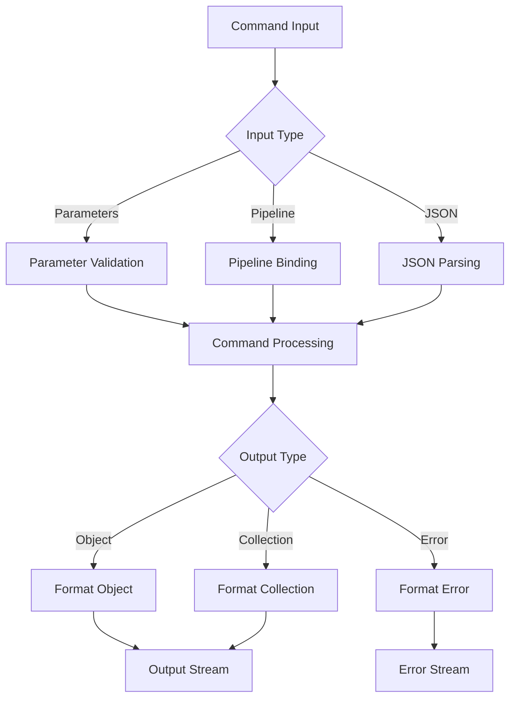
```mermaid
flowchart TD
    A[Command Input] --> B{Input Type}
    B -->|Parameters| C[Parameter Validation]
    B -->|Pipeline| D[Pipeline Binding]
    B -->|JSON| E[JSON Parsing]
    
    C --> F[Command Processing]
    D --> F
    E --> F
    
    F --> G{Output Type}
    G -->|Object| H[Format Object]
    G -->|Collection| I[Format Collection]
    G -->|Error| J[Format Error]
    
    H --> K[Output Stream]
    I --> K
    J --> L[Error Stream]
```

### 3.1.3 Help System Architecture

| Component | Implementation | Example |
|-----------|----------------|---------|
| Command Help | Comment-based help | Synopsis, Description, Parameters, Examples |
| About Topics | Markdown files | Concepts, Best Practices, Troubleshooting |
| Examples | Code samples | Common use cases with explanations |
| Parameter Help | Parameter attributes | Type, Required, Position, Pipeline support |

## 3.2 Data Management Design

### 3.2.1 Object Model

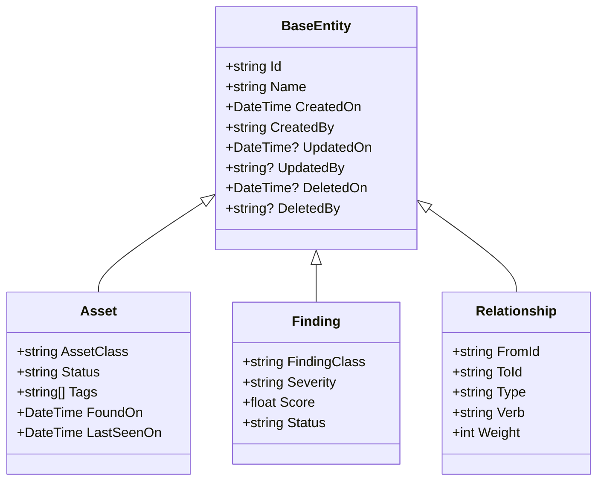
```mermaid
classDiagram
    class BaseEntity {
        +string Id
        +string Name
        +DateTime CreatedOn
        +string CreatedBy
        +DateTime? UpdatedOn
        +string? UpdatedBy
        +DateTime? DeletedOn
        +string? DeletedBy
    }
    
    class Asset {
        +string AssetClass
        +string Status
        +string[] Tags
        +DateTime FoundOn
        +DateTime LastSeenOn
    }
    
    class Finding {
        +string FindingClass
        +string Severity
        +float Score
        +string Status
    }
    
    class Relationship {
        +string FromId
        +string ToId
        +string Type
        +string Verb
        +int Weight
    }
    
    BaseEntity <|-- Asset
    BaseEntity <|-- Finding
    BaseEntity <|-- Relationship
```

### 3.2.2 Cache Management

| Cache Type | Implementation | Lifetime |
|------------|----------------|----------|
| Memory Cache | ConcurrentDictionary | Session duration |
| Configuration | SecretStore | Persistent |
| Session State | ThreadLocal storage | Command duration |
| Result Cache | Timed expiration | 5 minutes default |

### 3.2.3 State Management

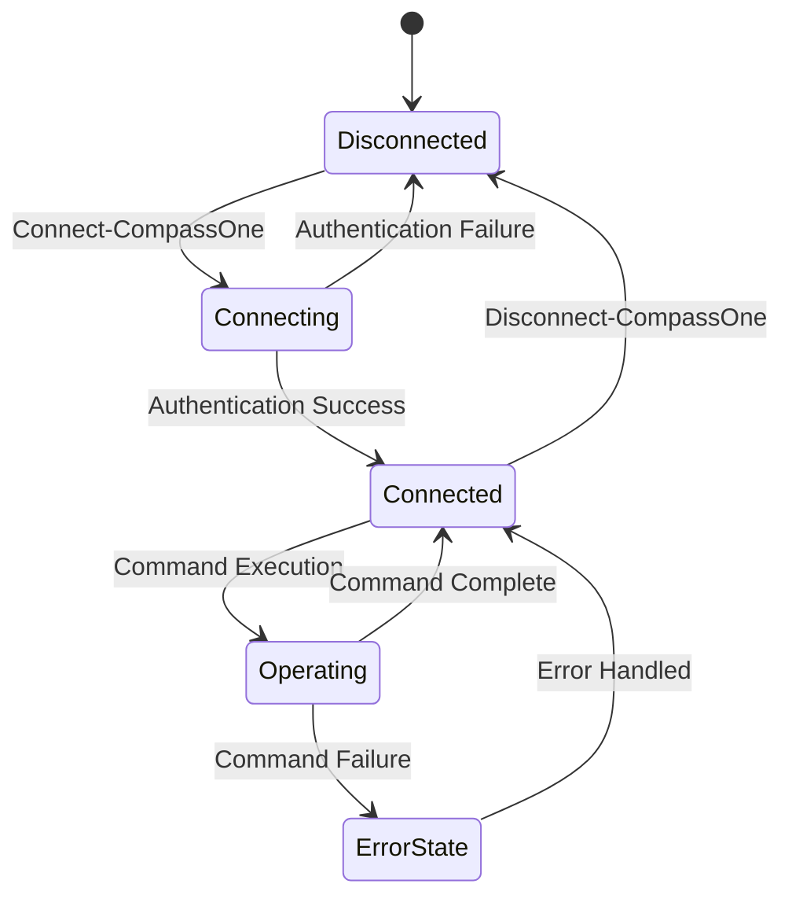
```mermaid
stateDiagram-v2
    [*] --> Disconnected
    Disconnected --> Connecting: Connect-CompassOne
    Connecting --> Connected: Authentication Success
    Connecting --> Disconnected: Authentication Failure
    Connected --> Operating: Command Execution
    Operating --> Connected: Command Complete
    Operating --> ErrorState: Command Failure
    ErrorState --> Connected: Error Handled
    Connected --> Disconnected: Disconnect-CompassOne
```

## 3.3 API Integration Design

### 3.3.1 API Client Architecture

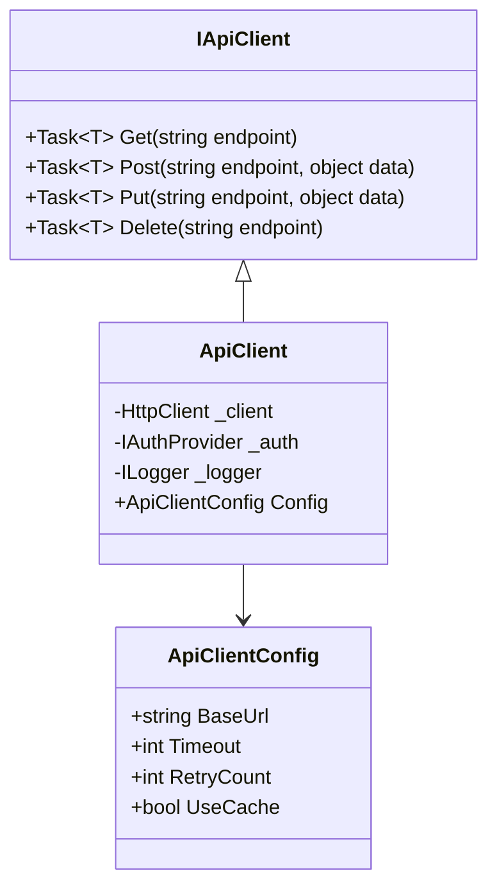
```mermaid
classDiagram
    class IApiClient {
        +Task~T~ Get(string endpoint)
        +Task~T~ Post(string endpoint, object data)
        +Task~T~ Put(string endpoint, object data)
        +Task~T~ Delete(string endpoint)
    }
    
    class ApiClient {
        -HttpClient _client
        -IAuthProvider _auth
        -ILogger _logger
        +ApiClientConfig Config
    }
    
    class ApiClientConfig {
        +string BaseUrl
        +int Timeout
        +int RetryCount
        +bool UseCache
    }
    
    IApiClient <|-- ApiClient
    ApiClient --> ApiClientConfig
```

### 3.3.2 Authentication Flow

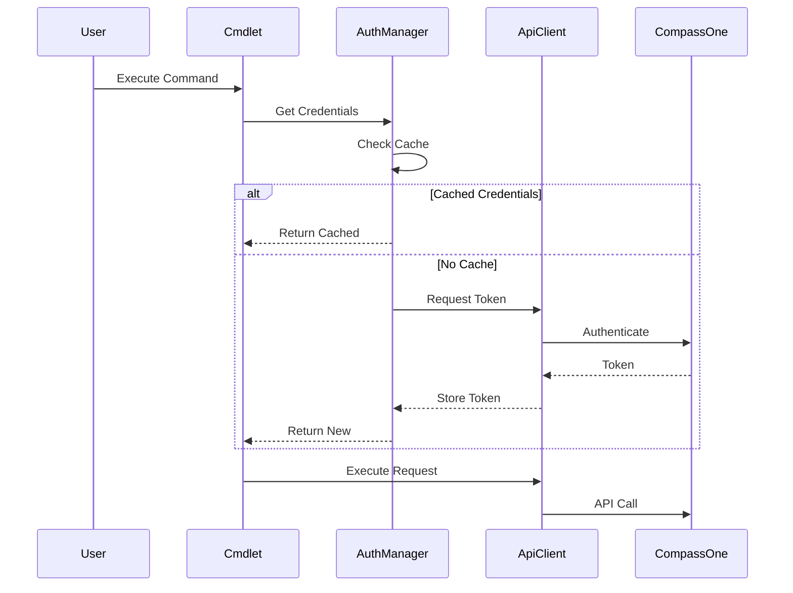
```mermaid
sequenceDiagram
    participant User
    participant Cmdlet
    participant AuthManager
    participant ApiClient
    participant CompassOne

    User->>Cmdlet: Execute Command
    Cmdlet->>AuthManager: Get Credentials
    AuthManager->>AuthManager: Check Cache
    alt Cached Credentials
        AuthManager-->>Cmdlet: Return Cached
    else No Cache
        AuthManager->>ApiClient: Request Token
        ApiClient->>CompassOne: Authenticate
        CompassOne-->>ApiClient: Token
        ApiClient-->>AuthManager: Store Token
        AuthManager-->>Cmdlet: Return New
    end
    Cmdlet->>ApiClient: Execute Request
    ApiClient->>CompassOne: API Call
```

### 3.3.3 Error Handling Strategy

| Error Type | Handling | Recovery |
|------------|----------|----------|
| Authentication | Retry with refresh | Automatic token refresh |
| Network | Exponential backoff | Configurable retry count |
| API | Response parsing | Error object mapping |
| Validation | Parameter checking | Clear error messages |
| Rate Limit | Throttling | Automatic wait/retry |

### 3.3.4 Integration Patterns

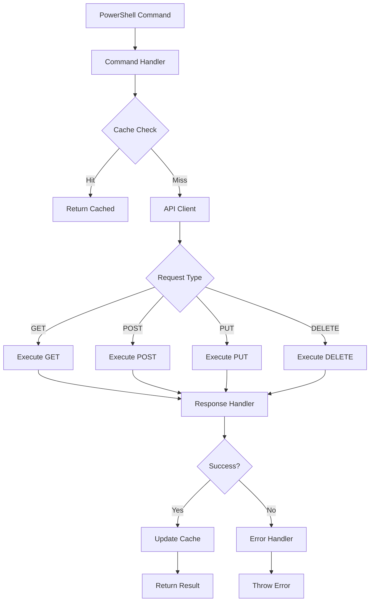
```mermaid
flowchart TD
    A[PowerShell Command] --> B[Command Handler]
    B --> C{Cache Check}
    C -->|Hit| D[Return Cached]
    C -->|Miss| E[API Client]
    
    E --> F{Request Type}
    F -->|GET| G[Execute GET]
    F -->|POST| H[Execute POST]
    F -->|PUT| I[Execute PUT]
    F -->|DELETE| J[Execute DELETE]
    
    G --> K[Response Handler]
    H --> K
    I --> K
    J --> K
    
    K --> L{Success?}
    L -->|Yes| M[Update Cache]
    L -->|No| N[Error Handler]
    
    M --> O[Return Result]
    N --> P[Throw Error]
```

## 3.4 Cross-Cutting Concerns

### 3.4.1 Logging Architecture

| Log Level | Usage | Implementation |
|-----------|-------|----------------|
| Error | Failures and exceptions | Write-Error |
| Warning | Potential issues | Write-Warning |
| Information | Operation status | Write-Information |
| Verbose | Detailed execution | Write-Verbose |
| Debug | Development details | Write-Debug |

### 3.4.2 Performance Optimization

| Aspect | Strategy | Implementation |
|--------|----------|----------------|
| Caching | In-memory cache | ConcurrentDictionary with expiration |
| Batching | Bulk operations | Pipeline processing |
| Connection | Connection pooling | HttpClient reuse |
| Throttling | Rate limiting | Token bucket algorithm |
| Resources | Memory management | Dispose pattern |

### 3.4.3 Security Architecture

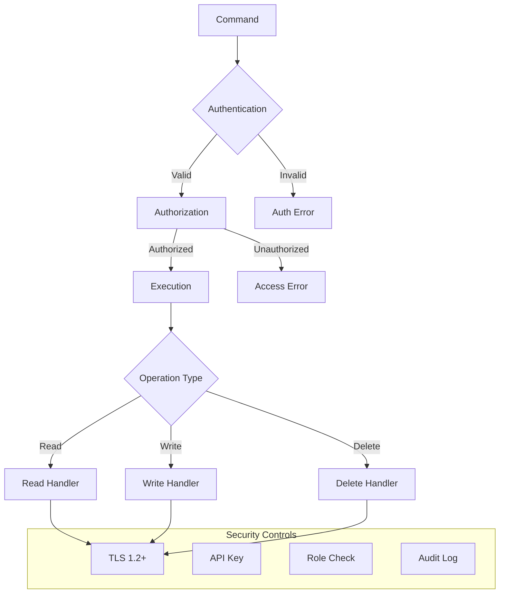
```mermaid
flowchart TD
    A[Command] --> B{Authentication}
    B -->|Valid| C[Authorization]
    B -->|Invalid| D[Auth Error]
    
    C -->|Authorized| E[Execution]
    C -->|Unauthorized| F[Access Error]
    
    E --> G{Operation Type}
    G -->|Read| H[Read Handler]
    G -->|Write| I[Write Handler]
    G -->|Delete| J[Delete Handler]
    
    subgraph Security Controls
        K[TLS 1.2+]
        L[API Key]
        M[Role Check]
        N[Audit Log]
    end
    
    H --> K
    I --> K
    J --> K
```

# 4. TECHNOLOGY STACK

## 4.1 PROGRAMMING LANGUAGES

| Language | Version | Usage | Justification |
|----------|---------|--------|---------------|
| PowerShell | 5.1+ (Windows)<br>7.0+ (Core) | Primary Module Language | - Native PowerShell integration<br>- Cross-platform support<br>- Built-in pipeline architecture<br>- Strong security features |
| C# | 6.0+ | Compiled Cmdlets | - Performance-critical operations<br>- Complex object handling<br>- Strong type system<br>- .NET integration |

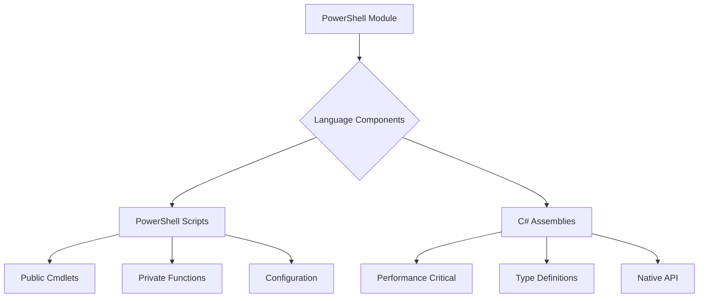
```mermaid
flowchart TD
    A[PowerShell Module] --> B{Language Components}
    B --> C[PowerShell Scripts]
    B --> D[C# Assemblies]
    
    C --> E[Public Cmdlets]
    C --> F[Private Functions]
    C --> G[Configuration]
    
    D --> H[Performance Critical]
    D --> I[Type Definitions]
    D --> J[Native API]
```

## 4.2 FRAMEWORKS & LIBRARIES

### Core Dependencies

| Framework | Version | Purpose | Justification |
|-----------|---------|---------|---------------|
| Microsoft.PowerShell.SecretStore | Latest | Credential Storage | - Secure credential management<br>- Cross-platform support<br>- PowerShell standard |
| PSScriptAnalyzer | Latest | Code Quality | - Static analysis<br>- Best practices enforcement<br>- Security validation |
| Pester | 5.0+ | Testing | - PowerShell native testing<br>- Mocking capabilities<br>- Code coverage |
| platyPS | Latest | Documentation | - Help system generation<br>- Markdown support<br>- PowerShell integration |

### Supporting Libraries

| Library | Version | Purpose | Justification |
|---------|---------|---------|---------------|
| System.Net.Http | Latest | API Communication | - Modern HTTP client<br>- TLS 1.2+ support<br>- Performance optimized |
| Newtonsoft.Json | Latest | JSON Processing | - High performance<br>- Complex object mapping<br>- Serialization control |

## 4.3 DATABASES & STORAGE

### Data Persistence

| Storage Type | Implementation | Purpose | Justification |
|-------------|----------------|---------|---------------|
| Configuration | SecretStore | Credential Storage | - Secure encryption<br>- Cross-platform<br>- PowerShell native |
| Cache | Memory Cache | Response Caching | - Fast access<br>- Memory efficient<br>- Thread safe |
| Session | ThreadLocal | State Management | - Request isolation<br>- Performance<br>- Security |
| Audit | File System | Logging | - Persistent storage<br>- Easy access<br>- Standard location |

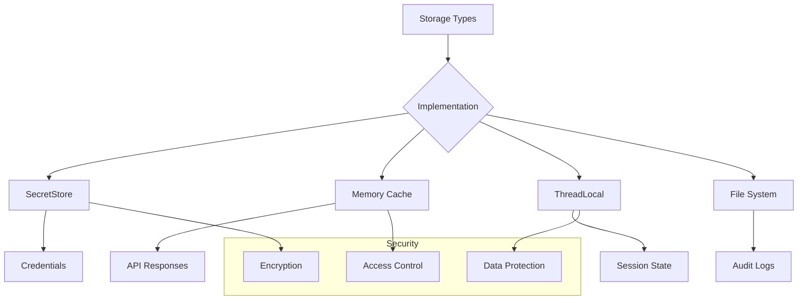
```mermaid
flowchart TD
    A[Storage Types] --> B{Implementation}
    
    B --> C[SecretStore]
    B --> D[Memory Cache]
    B --> E[ThreadLocal]
    B --> F[File System]
    
    C --> G[Credentials]
    D --> H[API Responses]
    E --> I[Session State]
    F --> J[Audit Logs]
    
    subgraph Security
        K[Encryption]
        L[Access Control]
        M[Data Protection]
    end
    
    C --> K
    D --> L
    E --> M
```

## 4.4 THIRD-PARTY SERVICES

### External Services

| Service | Purpose | Integration | Justification |
|---------|---------|-------------|---------------|
| CompassOne API | Core Platform | REST/HTTPS | - Primary service integration<br>- Security platform access<br>- Real-time data |
| PowerShell Gallery | Distribution | NuGet | - Official distribution<br>- Version management<br>- Dependency resolution |

### Monitoring & Telemetry

| Service | Purpose | Implementation | Justification |
|---------|---------|----------------|---------------|
| PowerShell Logging | Operation Tracking | Event Log | - Native integration<br>- Standard practice<br>- Audit compliance |
| Performance Counters | Metrics | .NET Counters | - Resource monitoring<br>- Performance tracking<br>- Diagnostics |

## 4.5 DEVELOPMENT & DEPLOYMENT

### Development Tools

| Tool | Version | Purpose | Justification |
|------|---------|---------|---------------|
| Visual Studio Code | Latest | Primary IDE | - PowerShell support<br>- Cross-platform<br>- Extension ecosystem |
| Git | 2.0+ | Version Control | - Industry standard<br>- Branch management<br>- Collaboration |
| GitHub | N/A | Source Control | - Code hosting<br>- Issue tracking<br>- CI/CD integration |

### Build & Deployment

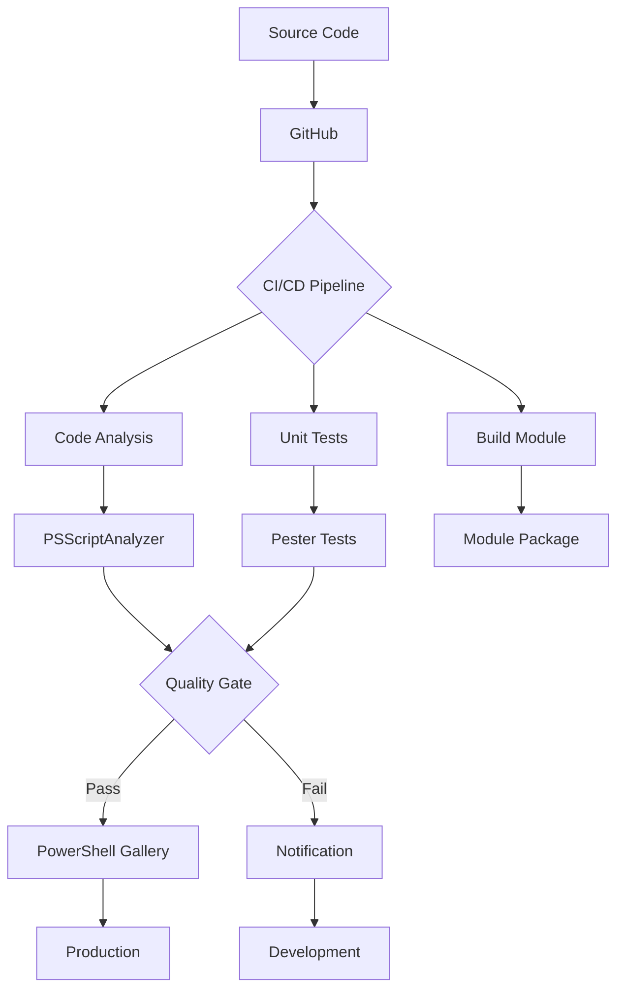
```mermaid
flowchart TD
    A[Source Code] --> B[GitHub]
    B --> C{CI/CD Pipeline}
    
    C --> D[Code Analysis]
    C --> E[Unit Tests]
    C --> F[Build Module]
    
    D --> G[PSScriptAnalyzer]
    E --> H[Pester Tests]
    F --> I[Module Package]
    
    G --> J{Quality Gate}
    H --> J
    
    J -->|Pass| K[PowerShell Gallery]
    J -->|Fail| L[Notification]
    
    K --> M[Production]
    L --> N[Development]
```

| Component | Implementation | Purpose | Justification |
|-----------|----------------|---------|---------------|
| CI/CD | GitHub Actions | Automation | - GitHub integration<br>- PowerShell support<br>- Cross-platform |
| Testing | Pester | Quality Assurance | - PowerShell native<br>- Comprehensive testing<br>- Mocking support |
| Publishing | PowerShellGet | Distribution | - Official channel<br>- Version control<br>- Dependency management |
| Documentation | platyPS | Help System | - PowerShell standard<br>- Markdown support<br>- Automated generation |

# 5. SYSTEM DESIGN

## 5.1 Command Line Interface Design

### 5.1.1 Command Structure

The module follows PowerShell's standard command-line interface patterns with verb-noun cmdlets:

| Command Category | Example Commands | Description |
|-----------------|------------------|-------------|
| Asset Management | `Get-Asset`<br>`New-Asset`<br>`Set-Asset`<br>`Remove-Asset` | Core asset CRUD operations |
| Finding Management | `Get-Finding`<br>`New-Finding`<br>`Set-Finding`<br>`Remove-Finding` | Security finding operations |
| Incident Management | `Get-Incident`<br>`New-Incident`<br>`Set-Incident`<br>`Remove-Incident` | Incident handling operations |
| Configuration | `Connect-CompassOne`<br>`Disconnect-CompassOne`<br>`Set-CompassOneConfig` | Module configuration |

### 5.1.2 Parameter Design

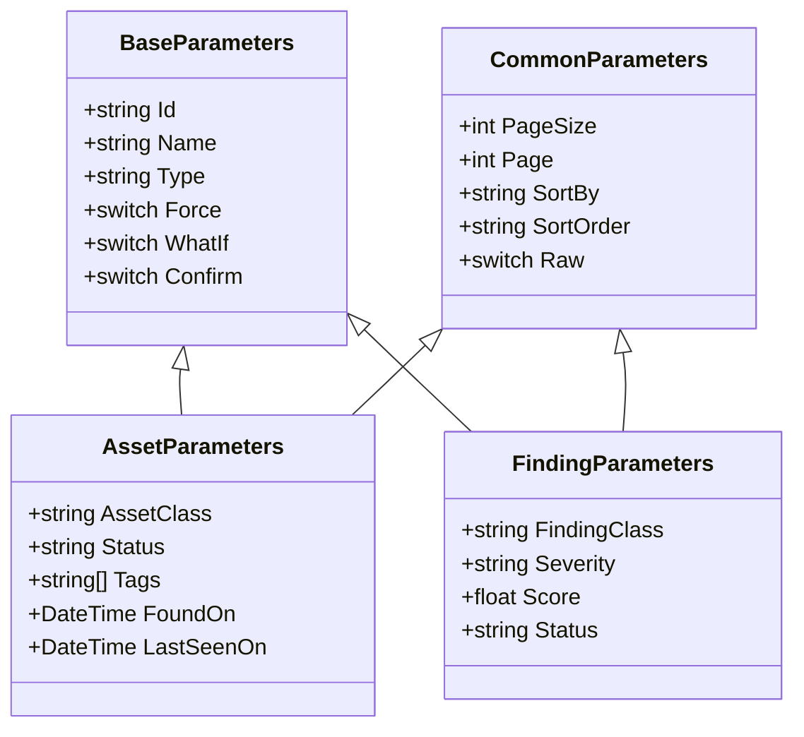
```mermaid
classDiagram
    class BaseParameters {
        +string Id
        +string Name
        +string Type
        +switch Force
        +switch WhatIf
        +switch Confirm
    }
    
    class CommonParameters {
        +int PageSize
        +int Page
        +string SortBy
        +string SortOrder
        +switch Raw
    }
    
    class AssetParameters {
        +string AssetClass
        +string Status
        +string[] Tags
        +DateTime FoundOn
        +DateTime LastSeenOn
    }
    
    class FindingParameters {
        +string FindingClass
        +string Severity
        +float Score
        +string Status
    }
    
    BaseParameters <|-- AssetParameters
    BaseParameters <|-- FindingParameters
    CommonParameters <|-- AssetParameters
    CommonParameters <|-- FindingParameters
```

### 5.1.3 Output Formatting

```powershell
# Default table view for assets
$defaultProperties = @(
    @{Name='Id'; Expression={$_.Id}},
    @{Name='Name'; Expression={$_.Name}},
    @{Name='Status'; Expression={$_.Status}},
    @{Name='LastSeenOn'; Expression={$_.LastSeenOn}}
)

Update-TypeData -TypeName PSCompassOne.Asset -DefaultDisplayPropertySet $defaultProperties
```

## 5.2 API Integration Design

### 5.2.1 REST API Client Architecture

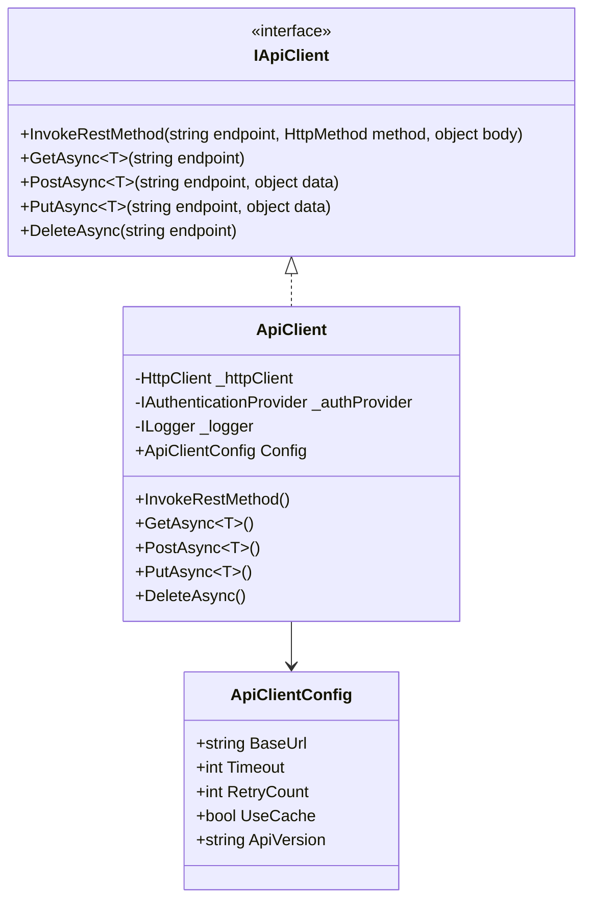
```mermaid
classDiagram
    class IApiClient {
        <<interface>>
        +InvokeRestMethod(string endpoint, HttpMethod method, object body)
        +GetAsync~T~(string endpoint)
        +PostAsync~T~(string endpoint, object data)
        +PutAsync~T~(string endpoint, object data)
        +DeleteAsync(string endpoint)
    }
    
    class ApiClient {
        -HttpClient _httpClient
        -IAuthenticationProvider _authProvider
        -ILogger _logger
        +ApiClientConfig Config
        +InvokeRestMethod()
        +GetAsync~T~()
        +PostAsync~T~()
        +PutAsync~T~()
        +DeleteAsync()
    }
    
    class ApiClientConfig {
        +string BaseUrl
        +int Timeout
        +int RetryCount
        +bool UseCache
        +string ApiVersion
    }
    
    IApiClient <|.. ApiClient
    ApiClient --> ApiClientConfig
```

### 5.2.2 Authentication Flow

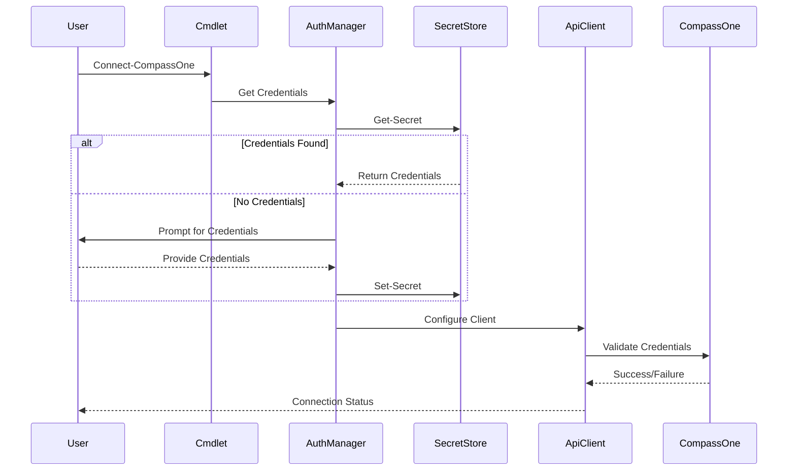
```mermaid
sequenceDiagram
    participant User
    participant Cmdlet
    participant AuthManager
    participant SecretStore
    participant ApiClient
    participant CompassOne

    User->>Cmdlet: Connect-CompassOne
    Cmdlet->>AuthManager: Get Credentials
    AuthManager->>SecretStore: Get-Secret
    alt Credentials Found
        SecretStore-->>AuthManager: Return Credentials
    else No Credentials
        AuthManager->>User: Prompt for Credentials
        User-->>AuthManager: Provide Credentials
        AuthManager->>SecretStore: Set-Secret
    end
    AuthManager->>ApiClient: Configure Client
    ApiClient->>CompassOne: Validate Credentials
    CompassOne-->>ApiClient: Success/Failure
    ApiClient-->>User: Connection Status
```

## 5.3 Data Management Design

### 5.3.1 Object Model

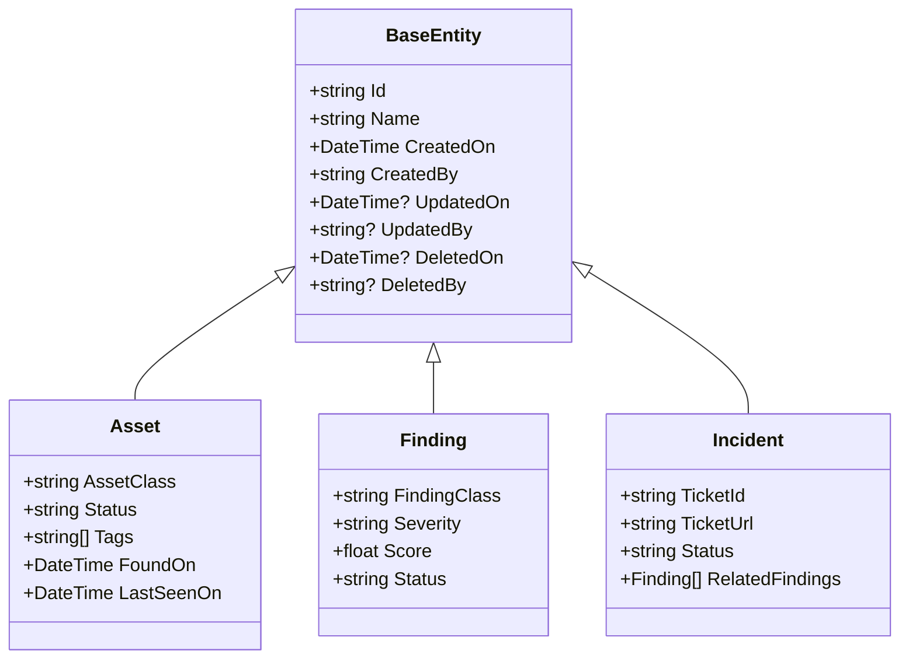
```mermaid
classDiagram
    class BaseEntity {
        +string Id
        +string Name
        +DateTime CreatedOn
        +string CreatedBy
        +DateTime? UpdatedOn
        +string? UpdatedBy
        +DateTime? DeletedOn
        +string? DeletedBy
    }
    
    class Asset {
        +string AssetClass
        +string Status
        +string[] Tags
        +DateTime FoundOn
        +DateTime LastSeenOn
    }
    
    class Finding {
        +string FindingClass
        +string Severity
        +float Score
        +string Status
    }
    
    class Incident {
        +string TicketId
        +string TicketUrl
        +string Status
        +Finding[] RelatedFindings
    }
    
    BaseEntity <|-- Asset
    BaseEntity <|-- Finding
    BaseEntity <|-- Incident
```

### 5.3.2 Cache Management

| Cache Type | Implementation | Purpose |
|------------|----------------|---------|
| Memory Cache | ConcurrentDictionary | Fast access to recent data |
| Configuration | SecretStore | Secure credential storage |
| Session State | ThreadLocal | Request context |
| Result Cache | MemoryCache | API response caching |

### 5.3.3 State Management


```mermaid
stateDiagram-v2
    [*] --> Disconnected
    Disconnected --> Connecting: Connect-CompassOne
    Connecting --> Connected: Authentication Success
    Connecting --> Disconnected: Authentication Failure
    Connected --> Operating: Command Execution
    Operating --> Connected: Command Complete
    Operating --> ErrorState: Command Failure
    ErrorState --> Connected: Error Handled
    Connected --> Disconnected: Disconnect-CompassOne
```

## 5.4 Error Handling Design

### 5.4.1 Error Hierarchy

```mermaid
classDiagram
    class PSCompassOneException {
        +string Message
        +string ErrorId
        +ErrorCategory Category
        +object TargetObject
    }
    
    class AuthenticationException {
        +string Reason
        +bool CanRetry
    }
    
    class ApiException {
        +HttpStatusCode StatusCode
        +string Response
    }
    
    class ValidationException {
        +string[] ValidationErrors
        +object InvalidValue
    }
    
    PSCompassOneException <|-- AuthenticationException
    PSCompassOneException <|-- ApiException
    PSCompassOneException <|-- ValidationException
```

### 5.4.2 Error Handling Strategy

| Error Type | Handling | Recovery |
|------------|----------|----------|
| Network | Retry with backoff | Automatic |
| Authentication | Token refresh | Automatic |
| Validation | Error message | Manual |
| API | Response parsing | Configurable |

## 5.5 Performance Design

### 5.5.1 Caching Strategy

```mermaid
flowchart TD
    A[Request] --> B{Cache Check}
    B -->|Hit| C[Return Cached]
    B -->|Miss| D[API Request]
    D --> E[Process Response]
    E --> F[Update Cache]
    F --> G[Return Result]
    
    subgraph Cache Management
        H[Expiration] --> I[Remove Old]
        J[Size Limit] --> K[Evict LRU]
        L[Memory Pressure] --> M[Clear Cache]
    end
```

### 5.5.2 Performance Optimizations

| Category | Implementation | Target |
|----------|----------------|--------|
| Network | Connection pooling | Reuse connections |
| Memory | Object pooling | Reduce allocations |
| CPU | Parallel processing | Bulk operations |
| I/O | Async operations | Non-blocking calls |

## 5.6 Security Design

### 5.6.1 Security Architecture

```mermaid
flowchart TD
    A[Command] --> B{Authentication}
    B -->|Valid| C[Authorization]
    B -->|Invalid| D[Auth Error]
    
    C -->|Authorized| E[Execution]
    C -->|Unauthorized| F[Access Error]
    
    E --> G{Operation Type}
    G -->|Read| H[Read Handler]
    G -->|Write| I[Write Handler]
    G -->|Delete| J[Delete Handler]
    
    subgraph Security Controls
        K[TLS 1.2+]
        L[API Key]
        M[Role Check]
        N[Audit Log]
    end
    
    H --> K
    I --> K
    J --> K
```

### 5.6.2 Security Implementation

| Layer | Mechanism | Implementation |
|-------|-----------|----------------|
| Transport | TLS 1.2+ | HTTPS |
| Authentication | API Key | SecretStore |
| Authorization | Role-based | API-enforced |
| Audit | Event Log | File-based |

# 6. USER INTERFACE DESIGN

The PSCompassOne module provides a command-line interface through PowerShell. While not a traditional graphical UI, the module implements consistent terminal-based interfaces and formatting.

## 6.1 Command Line Interface Elements

### Key/Legend
```
[?] - Help/Documentation    [i] - Information/Status
[+] - Create/Add           [x] - Delete/Remove  
[<] - Previous             [>] - Next Page
[^] - Upload/Import        [#] - Menu/Dashboard
[@] - User/Profile         [!] - Warning/Error
[=] - Settings            [*] - Important/Required
```

### 6.1.1 Main Help Display
```
+----------------------------------------------------------+
|                    PSCompassOne Help                       |
+----------------------------------------------------------+
| [?] Available Commands:                                    |
|  +-- Asset Management                                     |
|      |-- Get-Asset                                        |
|      |-- New-Asset                                        |
|      |-- Set-Asset                                        |
|      |-- Remove-Asset                                     |
|  +-- Finding Management                                   |
|      |-- Get-Finding                                      |
|      |-- New-Finding                                      |
|      |-- Set-Finding                                      |
|      |-- Remove-Finding                                   |
|  +-- Configuration                                        |
|      |-- Connect-CompassOne                              |
|      |-- Disconnect-CompassOne                           |
|      |-- Set-CompassOneConfig                            |
+----------------------------------------------------------+
| [i] Use Get-Help <command-name> for detailed help         |
+----------------------------------------------------------+
```

### 6.1.2 Connection Interface
```
+----------------------------------------------------------+
|                 Connect to CompassOne                      |
+----------------------------------------------------------+
| [@] Authentication Method:                                 |
|     ( ) API Key                                           |
|     ( ) Environment Variables                             |
|     ( ) Secret Store                                      |
|                                                           |
| [*] API URL: [.......................................] |
| [*] API Key: [.......................................] |
|                                                           |
| [ ] Remember credentials in SecretStore                   |
|                                                           |
| [Test Connection]        [Connect]        [Cancel]        |
+----------------------------------------------------------+
| [i] Status: Ready to connect                              |
+----------------------------------------------------------+
```

### 6.1.3 Asset List Display
```
+----------------------------------------------------------+
|                      Asset List                            |
+----------------------------------------------------------+
| [Filter: ............] [Sort: Name v]  [Refresh]          |
+----------------------------------------------------------+
| ID        | Name          | Type    | Status    | Tags    |
|-----------|---------------|---------|-----------|---------|
| abc123    | WebServer01   | Device  | Active    | [Prod] |
| def456    | DbServer02    | Device  | Active    | [Dev]  |
| ghi789    | Container01   | Docker  | Running   | [Test] |
+----------------------------------------------------------+
| [<] Page 1/5 [>]    Items: 1-3 of 14    [Export]         |
+----------------------------------------------------------+
```

### 6.1.4 Progress Indicators
```
+----------------------------------------------------------+
|                    Operation Progress                      |
+----------------------------------------------------------+
| [i] Retrieving assets...                                  |
| [=====================================>     ] 80%         |
|                                                           |
| Items processed: 80/100                                   |
| Estimated time remaining: 00:00:20                        |
|                                                           |
| [Cancel Operation]                                        |
+----------------------------------------------------------+
```

### 6.1.5 Error Display
```
+----------------------------------------------------------+
|                     Error Details                          |
+----------------------------------------------------------+
| [!] Operation Failed                                      |
|                                                           |
| Error Type: Authentication Error                          |
| Message: Invalid API key provided                         |
|                                                           |
| Recommended Actions:                                      |
| +-- Verify API key is correct                            |
| +-- Check network connectivity                           |
| +-- Ensure API endpoint is accessible                    |
|                                                           |
| [View Full Error]    [Retry]    [Cancel]                 |
+----------------------------------------------------------+
```

### 6.1.6 Configuration Interface
```
+----------------------------------------------------------+
|                  Module Configuration                      |
+----------------------------------------------------------+
| [=] General Settings                                      |
|     [x] Enable verbose logging                            |
|     [x] Show progress bars                               |
|     [ ] Auto-refresh results                             |
|                                                           |
| [=] Connection Settings                                   |
|     Timeout (seconds): [30........]                       |
|     Max retries: [3]                                     |
|     Cache duration: [60........]                         |
|                                                           |
| [=] Output Preferences                                    |
|     Default format: [Table v]                            |
|     Items per page: [50...]                             |
|                                                           |
| [Save Settings]                [Restore Defaults]         |
+----------------------------------------------------------+
```

## 6.2 Output Formatting

### 6.2.1 Standard Table Output
```powershell
# Example of default table formatting for assets
Format-Table -InputObject $assets -View Standard

+----------------------------------------------------------+
| Id       | Name       | Status  | LastSeen  | Type        |
|----------|------------|---------|-----------|-------------|
| abc123   | Server01   | Active  | 5min ago  | Device     |
| def456   | App02      | Inactive| 1day ago  | Container  |
+----------------------------------------------------------+
```

### 6.2.2 Detailed List Output
```powershell
# Example of detailed list formatting
Format-List -InputObject $asset -Property *

+----------------------------------------------------------+
| Asset Details                                             |
| Id: abc123                                                |
| Name: Server01                                            |
| Type: Device                                              |
| Status: Active                                            |
| Created: 2023-01-01 10:00:00                             |
| LastSeen: 2023-06-15 14:30:00                            |
| Tags: Production, Critical                                |
| Description: Primary web server                           |
+----------------------------------------------------------+
```

## 6.3 Interactive Elements

### 6.3.1 Confirmation Prompts
```
+----------------------------------------------------------+
|                    Confirm Action                          |
+----------------------------------------------------------+
| [!] Warning: You are about to delete the following asset: |
|     Name: WebServer01                                     |
|     ID: abc123                                           |
|                                                           |
| This action cannot be undone.                            |
|                                                           |
| Are you sure you want to proceed?                        |
|                                                           |
| [Yes]                          [No]                      |
+----------------------------------------------------------+
```

### 6.3.2 Parameter Input
```
+----------------------------------------------------------+
|                    Create New Asset                        |
+----------------------------------------------------------+
| [*] Required fields                                       |
|                                                           |
| Name: [..........................................]        |
| Type: [Device v]                                         |
| Status: [Active v]                                       |
|                                                           |
| Tags: [Add Tags +]                                       |
| Description: [                                           ]|
|             [                                           ]|
|                                                           |
| [Create]                        [Cancel]                  |
+----------------------------------------------------------+
```

## 6.4 Help System Integration

### 6.4.1 Command Help
```
+----------------------------------------------------------+
|                    Command Help                            |
+----------------------------------------------------------+
| Get-Asset                                                 |
| [-Id <string>]                                           |
| [-Filter <string>]                                       |
| [-SortBy <string>]                                       |
| [-SortOrder <string>]                                    |
|                                                           |
| Description:                                              |
| Gets one or more assets from CompassOne.                 |
|                                                           |
| Examples:                                                 |
| Get-Asset -Id "abc123"                                   |
| Get-Asset -Filter "Type eq 'Device'"                     |
|                                                           |
| [Show Full Help]              [Show Examples]             |
+----------------------------------------------------------+
```

### 6.4.2 Interactive Help
```
+----------------------------------------------------------+
|                    Quick Help                              |
+----------------------------------------------------------+
| [?] Common Tasks:                                         |
|  +-- Connect to CompassOne                               |
|      |-- Connect-CompassOne -Url <url> -Key <key>       |
|  +-- List Assets                                         |
|      |-- Get-Asset                                      |
|  +-- Create Asset                                        |
|      |-- New-Asset -Name <name> -Type <type>            |
|                                                           |
| [Show More Tasks]            [Open Documentation]         |
+----------------------------------------------------------+
```

# 7. SECURITY CONSIDERATIONS

## 7.1 AUTHENTICATION AND AUTHORIZATION

### Authentication Methods

| Method | Implementation | Priority | Use Case |
|--------|----------------|----------|-----------|
| API Key | SecretStore integration | Primary | Long-term automation |
| Environment Variables | COMPASSONE_API_* vars | Secondary | CI/CD pipelines |
| Command Line | Parameter input | Tertiary | Interactive sessions |

### Authorization Flow

```mermaid
sequenceDiagram
    participant User
    participant Module
    participant SecretStore
    participant API
    participant RBAC

    User->>Module: Connect-CompassOne
    Module->>SecretStore: Get-Secret
    alt Secret Found
        SecretStore-->>Module: Return API Key
    else No Secret
        Module->>User: Request Credentials
        User-->>Module: Provide API Key
        Module->>SecretStore: Store-Secret
    end
    Module->>API: Authenticate
    API->>RBAC: Validate Permissions
    RBAC-->>API: Return Role
    API-->>Module: Return Session Token
    Module-->>User: Connection Status
```

### Role-Based Access Control

| Role | Permissions | Implementation |
|------|-------------|----------------|
| Reader | Read-only access | Get-* cmdlets only |
| Contributor | Create/Update access | Get-*, New-*, Set-* cmdlets |
| Administrator | Full access | All cmdlets including Remove-* |
| Security | Security operations | Security-related cmdlets only |

## 7.2 DATA SECURITY

### Data Protection Mechanisms

| Data Type | Protection Method | Implementation |
|-----------|------------------|----------------|
| API Credentials | AES-256 encryption | SecretStore |
| Session Tokens | Memory encryption | SecureString |
| Cached Data | DPAPI encryption | Protected files |
| Audit Logs | SHA-256 signing | Signed log files |

### Data Classification

```mermaid
flowchart TD
    A[Data Input] --> B{Classification}
    B -->|High Sensitivity| C[Encrypted Storage]
    B -->|Medium Sensitivity| D[Protected Storage]
    B -->|Low Sensitivity| E[Standard Storage]
    
    C --> F[SecretStore]
    D --> G[SecureString]
    E --> H[Regular Variables]
    
    F --> I[Secure Output]
    G --> I
    H --> J[Standard Output]
```

### Data Handling Rules

| Data Category | Handling Requirements | Implementation |
|---------------|----------------------|-----------------|
| Credentials | Never in plaintext | SecureString conversion |
| PII | Masked in output | Data masking functions |
| Secrets | Encrypted at rest | SecretStore storage |
| Audit Data | Tamper-proof | Digital signatures |

## 7.3 SECURITY PROTOCOLS

### Communication Security

| Protocol | Version | Purpose |
|----------|---------|---------|
| TLS | 1.2+ | API communication |
| HTTPS | 1.1+ | Web requests |
| SSH | 2.0+ | Remote operations |
| DPAPI | Latest | Local encryption |

### Security Operations

```mermaid
stateDiagram-v2
    [*] --> ValidateEnvironment
    ValidateEnvironment --> SecureConnection
    SecureConnection --> AuthenticateUser
    AuthenticateUser --> ValidatePermissions
    ValidatePermissions --> ExecuteOperation
    ExecuteOperation --> AuditLog
    AuditLog --> CleanupSecrets
    CleanupSecrets --> [*]
    
    ExecuteOperation --> HandleError
    HandleError --> AuditLog
```

### Security Controls

| Control Type | Implementation | Verification |
|-------------|----------------|--------------|
| Input Validation | Parameter validation | PSScriptAnalyzer |
| Output Encoding | HTML/JSON encoding | Built-in encoders |
| Error Handling | Try-Catch blocks | Error action preference |
| Logging | Write-SecurityLog | Event log integration |
| Rate Limiting | Token bucket | API compliance |

### Security Compliance

| Standard | Requirements | Implementation |
|----------|--------------|----------------|
| FIPS 140-2 | Cryptographic modules | .NET FIPS compliance |
| NIST 800-53 | Security controls | Access control matrix |
| GDPR | Data protection | PII handling procedures |
| SOC 2 | Security operations | Audit trail maintenance |

### Incident Response

```mermaid
flowchart TD
    A[Security Event] --> B{Severity}
    B -->|High| C[Immediate Response]
    B -->|Medium| D[Standard Response]
    B -->|Low| E[Logged Response]
    
    C --> F[Block Operation]
    D --> G[Warning User]
    E --> H[Log Event]
    
    F --> I[Security Alert]
    G --> I
    H --> J[Audit Record]
    
    I --> K[Incident Report]
    J --> L[Security Review]
```

### Security Monitoring

| Metric | Monitoring Method | Alert Threshold |
|--------|------------------|-----------------|
| Failed Authentications | Event counting | >3 in 5 minutes |
| API Rate Limits | Request tracking | >80% of limit |
| Security Violations | Pattern matching | Any occurrence |
| Data Access | Audit logging | Unauthorized attempts |

# 8. INFRASTRUCTURE

## 8.1 DEPLOYMENT ENVIRONMENT

The PSCompassOne module supports multiple deployment environments to accommodate various user scenarios:

| Environment Type | Description | Use Case |
|-----------------|-------------|-----------|
| Local Development | Developer workstations | Module development and testing |
| PowerShell Gallery | Public distribution | Production module distribution |
| Private Repository | Enterprise deployment | Controlled distribution |
| CI/CD Environment | Automated testing | Quality assurance |

### Environment Requirements

```mermaid
flowchart TD
    A[Deployment Environments] --> B[Local]
    A --> C[PowerShell Gallery]
    A --> D[Private Repository]
    A --> E[CI/CD]
    
    B --> F[Development Tools]
    F --> G[VS Code]
    F --> H[PowerShell 7.0+]
    F --> I[Git]
    
    C --> J[Public Access]
    J --> K[NuGet Package]
    J --> L[Version Control]
    
    D --> M[Enterprise]
    M --> N[Internal NuGet]
    M --> O[Access Control]
    
    E --> P[Automation]
    P --> Q[GitHub Actions]
    P --> R[Azure Pipelines]
```

## 8.2 CLOUD SERVICES

The module leverages cloud services for distribution and testing:

| Service | Purpose | Implementation |
|---------|---------|----------------|
| PowerShell Gallery | Module distribution | NuGet package hosting |
| GitHub | Source control and CI/CD | Repository and Actions |
| Azure DevOps | Enterprise CI/CD | Build and release pipelines |

## 8.3 CONTAINERIZATION

Development and testing environments are containerized for consistency:

```mermaid
flowchart LR
    A[Container Images] --> B[Development]
    A --> C[Testing]
    A --> D[Documentation]
    
    B --> E[powershell:7.0]
    B --> F[powershell:5.1]
    
    C --> G[pester-runner]
    C --> H[analysis-runner]
    
    D --> I[docs-builder]
    
    subgraph "Base Images"
        J[mcr.microsoft.com/powershell]
    end
```

### Container Specifications

| Container | Base Image | Purpose | Tools |
|-----------|------------|---------|-------|
| dev-env | powershell:7.0 | Development | VS Code Server, Git, Dev Tools |
| test-runner | powershell:7.0 | Testing | Pester, PSScriptAnalyzer |
| docs-builder | powershell:7.0 | Documentation | platyPS, MarkdownPS |

## 8.4 ORCHESTRATION

Local development orchestration is managed through Docker Compose:

```yaml
version: '3.8'
services:
  dev:
    image: pscompassone-dev
    volumes:
      - .:/workspace
    environment:
      - POWERSHELL_TELEMETRY_OPTOUT=1
  
  test:
    image: pscompassone-test
    volumes:
      - .:/workspace
    command: ["pwsh", "-c", "Invoke-Pester"]
  
  docs:
    image: pscompassone-docs
    volumes:
      - .:/workspace
    command: ["pwsh", "-c", "New-MarkdownHelp"]
```

## 8.5 CI/CD PIPELINE

The continuous integration and deployment pipeline is implemented using GitHub Actions:

```mermaid
flowchart TD
    A[Source Push] --> B{Build Stage}
    B --> C[Install Dependencies]
    C --> D[Run Tests]
    D --> E[Code Analysis]
    
    E --> F{Quality Gate}
    F -->|Pass| G[Build Module]
    F -->|Fail| H[Notify Failure]
    
    G --> I{Branch Type}
    I -->|Main| J[Release]
    I -->|Feature| K[Preview]
    
    J --> L[PowerShell Gallery]
    K --> M[GitHub Packages]
    
    subgraph "Quality Checks"
        N[Pester Tests]
        O[PSScriptAnalyzer]
        P[Code Coverage]
    end
```

### Pipeline Stages

| Stage | Purpose | Tools |
|-------|---------|-------|
| Build | Compile module | PowerShell Build Tools |
| Test | Run test suite | Pester |
| Analyze | Code quality | PSScriptAnalyzer |
| Document | Generate docs | platyPS |
| Package | Create package | NuGet |
| Publish | Distribution | PowerShell Gallery |

### Deployment Configuration

```yaml
name: PSCompassOne CI/CD

on:
  push:
    branches: [ main, develop ]
  pull_request:
    branches: [ main ]

jobs:
  build:
    runs-on: ubuntu-latest
    steps:
      - uses: actions/checkout@v2
      - name: Setup PowerShell
        uses: PowerShell/PowerShell@v1
      - name: Install dependencies
        run: |
          Install-Module Pester -Force
          Install-Module PSScriptAnalyzer -Force
      - name: Run Tests
        run: Invoke-Pester -CI
      - name: Publish
        if: github.ref == 'refs/heads/main'
        run: Publish-Module -Path ./src -NuGetApiKey ${{ secrets.PSGALLERY_API_KEY }}
```

### Release Management

| Release Type | Trigger | Target |
|-------------|---------|--------|
| Production | Main branch merge | PowerShell Gallery |
| Preview | Development push | GitHub Packages |
| Hotfix | Emergency fix | Both |

# APPENDICES

## A.1 ADDITIONAL TECHNICAL INFORMATION

### A.1.1 PowerShell Module Structure

```mermaid
flowchart TD
    A[PSCompassOne Module] --> B[Public Functions]
    A --> C[Private Functions]
    A --> D[Data]
    A --> E[Tests]
    
    B --> F[Asset Cmdlets]
    B --> G[Finding Cmdlets]
    B --> H[Incident Cmdlets]
    B --> I[Config Cmdlets]
    
    C --> J[API Client]
    C --> K[Auth Provider]
    C --> L[Cache Manager]
    C --> M[Error Handler]
    
    D --> N[Format Files]
    D --> O[Type Data]
    D --> P[Help Files]
    
    E --> Q[Unit Tests]
    E --> R[Integration Tests]
    E --> S[Acceptance Tests]
```

### A.1.2 API Response Caching Strategy

| Cache Type | Implementation | Lifetime | Use Case |
|------------|----------------|----------|-----------|
| Memory Cache | ConcurrentDictionary | Session | Frequent queries |
| Object Cache | PSCustomObject | Command | Parameter sets |
| Type Cache | TypeData | Module | Format data |
| Auth Cache | SecureString | Token lifetime | API tokens |

## A.2 GLOSSARY

| Term | Definition |
|------|------------|
| Asset Class | Category of asset in CompassOne (Device, Container, Software, etc.) |
| Bulk Operation | Processing multiple items in a single command execution |
| Cmdlet Binding | PowerShell's parameter binding and validation system |
| Finding Class | Category of security finding (Alert, Event, Incident) |
| Format View | PowerShell's custom display format for object types |
| Parameter Set | Group of parameters that can be used together in a command |
| Pipeline Input | Objects passed between commands using PowerShell pipeline |
| Type Data | Extended type information for PowerShell objects |

## A.3 ACRONYMS

| Acronym | Definition |
|---------|------------|
| API | Application Programming Interface |
| CRUD | Create, Read, Update, Delete |
| FIPS | Federal Information Processing Standards |
| HTTP | Hypertext Transfer Protocol |
| JSON | JavaScript Object Notation |
| RBAC | Role-Based Access Control |
| REST | Representational State Transfer |
| SOC | Security Operations Center |
| SSL | Secure Sockets Layer |
| TLS | Transport Layer Security |
| UUID | Universally Unique Identifier |
| XML | Extensible Markup Language |

## A.4 COMMAND NAMING CONVENTIONS

| Verb | Usage | Example |
|------|--------|---------|
| Get | Retrieve data | Get-Asset |
| New | Create new resource | New-Finding |
| Set | Modify existing resource | Set-CompassOneConfig |
| Remove | Delete resource | Remove-Incident |
| Connect | Establish connection | Connect-CompassOne |
| Disconnect | Close connection | Disconnect-CompassOne |
| Test | Validate configuration | Test-CompassOneConnection |
| Import | Import data | Import-CompassOneAsset |
| Export | Export data | Export-CompassOneReport |

## A.5 ERROR CATEGORIES

| Category | Description | Example |
|----------|-------------|---------|
| AuthenticationError | Credential/token issues | Invalid API key |
| ConnectionError | Network/endpoint issues | Timeout |
| ValidationError | Input validation failures | Invalid parameter |
| ResourceNotFound | Missing resource | Asset not found |
| OperationTimeout | Operation time limit exceeded | API timeout |
| SecurityError | Security policy violations | Access denied |
| InvalidOperation | Unsupported operations | Invalid state |
| LimitExceeded | Resource limits reached | Rate limit |

## A.6 RESPONSE STATUS CODES

| Code Range | Category | Handling |
|------------|----------|----------|
| 2xx | Success | Return result |
| 3xx | Redirection | Follow redirect |
| 4xx | Client Error | Throw error |
| 5xx | Server Error | Retry with backoff |

## A.7 ENVIRONMENT VARIABLES

| Variable | Purpose | Example |
|----------|---------|---------|
| COMPASSONE_API_URL | API endpoint | https://api.compassone.blackpoint.io |
| COMPASSONE_API_KEY | Authentication | sk_live_123abc... |
| COMPASSONE_API_VERSION | API version | v1 |
| COMPASSONE_TIMEOUT | Request timeout | 30 |
| COMPASSONE_MAX_RETRY | Retry attempts | 3 |
| COMPASSONE_LOG_LEVEL | Logging detail | Verbose |
| COMPASSONE_CACHE_TTL | Cache lifetime | 3600 |

## A.8 COMMON PARAMETERS

| Parameter | Type | Description |
|-----------|------|-------------|
| -WhatIf | Switch | Simulation mode |
| -Confirm | Switch | Prompt for confirmation |
| -Verbose | Switch | Detailed output |
| -Debug | Switch | Debug information |
| -ErrorAction | ActionPreference | Error handling behavior |
| -ErrorVariable | String | Error capture variable |
| -WarningAction | ActionPreference | Warning handling behavior |
| -WarningVariable | String | Warning capture variable |